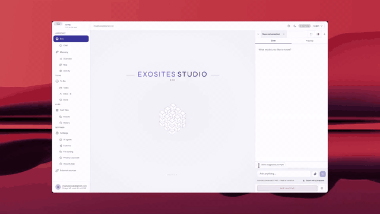
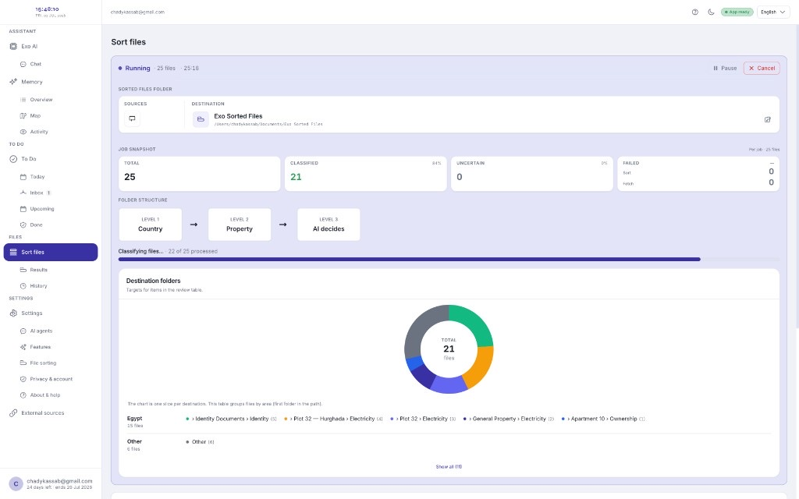
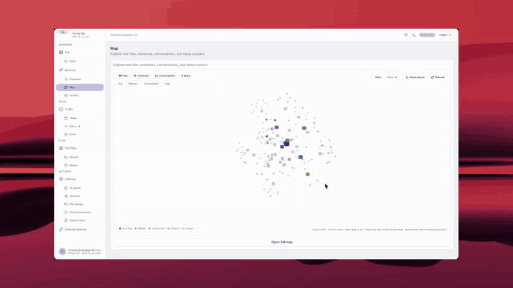
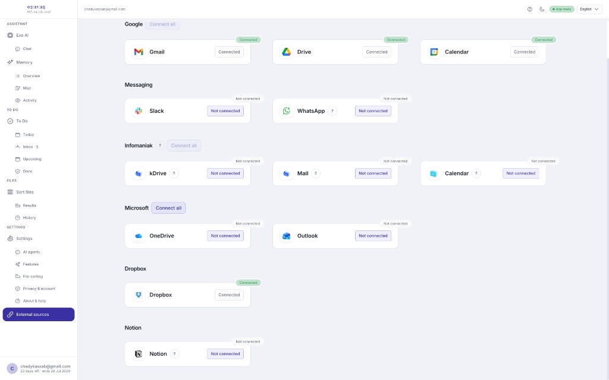

<h1 align="center">
  
  &nbsp;EXO
</h1>

<p align="center">
  <strong>Every file lands in the right folder — without you doing the work.</strong>
</p>

<p align="center">
  <a href="https://exosites.ch/downloads/exo-assistant/"></a>
</p>

<p align="center">
  <a href="https://github.com/Chadoud/assistant-ai/releases"></a>
  <a href="LICENSE"></a>
</p>

<p align="center">
  
</p>

<p align="center">
  <sub>local-first · cloud sort · macOS + Windows · v1.1.46</sub>
</p>

- **Smart sort** — drop messy files, review plain-language reasons, apply in bulk, undo anytime
- **Second brain** — memories, map, tasks, and conversations in one place
- **Connectors** — Gmail, Google Drive, OneDrive, Outlook, Dropbox, Notion, Infomaniak, WhatsApp, and more

EXO is a local-first desktop app for AI file sorting, a second brain, and an assistant with chat and voice.

**Your files stay on your machine.** Sort classification runs on Exo cloud when you sign in — no local LLM or sort API key required. Optional local tools handle OCR, scans, and offline speech.

---

## Preview

<p align="center">
  <br />
  <sub><b>Smart sort</b> — classify and route files</sub>
</p>

<p align="center">
  <br />
  <sub><b>Memory map</b> — files, memories, conversations</sub>
</p>

<p align="center">
  <br />
  <sub><b>External sources</b> — connect your accounts</sub>
</p>

---

## Download

| Platform | Installer |
|:---------|:----------|
| **Windows** (x64) | [`EXO Setup.exe`](https://exosites.ch/downloads/exo-assistant/) · [GitHub Releases](https://github.com/Chadoud/assistant-ai/releases) |
| **macOS** (Intel + Apple Silicon) | [`EXO.dmg`](https://exosites.ch/downloads/exo-assistant/) · [GitHub Releases](https://github.com/Chadoud/assistant-ai/releases) |

<sub>Installers are unsigned — Windows SmartScreen and macOS Gatekeeper will warn on first launch. See [INSTALL](docs/INSTALL.md) · [macOS](docs/MACOS.md).</sub>

### Quickstart

1. **Install and launch** the desktop app (~500 MB installed).
2. **Sign in** with your Exo account — sorting uses Exo’s cloud AI (no Ollama / sort API key needed).
3. **Choose an output folder**, drop files on **Sort**, review reasons, **Apply**. Undo anytime from **History**.

<sub>Optional: OCR, local vision, and chat API keys — see [docs/INSTALL.md](docs/INSTALL.md).</sub>

<details>
<summary><strong>How it works, privacy &amp; troubleshooting</strong></summary>

<br />

#### How processing works

| What | Where it runs |
|:-----|:--------------|
| File storage & moves | Your computer (output folder you choose) |
| Sort / classify (LLM) | **Exo cloud** after sign-in |
| Chat & agent planning | Your configured cloud provider (API key) |
| OCR (Tesseract) | Local (optional) |
| Vision for scans | Local Ollama model (optional) |
| Memory search embeddings | Optional local Ollama; lexical search always works offline |

Developers can run **local Ollama** for sort instead of cloud — see Development below.

#### System requirements

- **Windows 10/11 (x64)** or **macOS 12+** (Apple Silicon or Intel)
- Disk: ~500 MB for the app; optional local add-ons (vision ~1–4 GB, Whisper, Tesseract ~50 MB)
- RAM: 8 GB minimum; 16 GB recommended for local vision or large batches
- Network: required for **sign-in** and **cloud sort**

#### Privacy

- **Files** are read and moved on your device. Sort sends **document text** (not necessarily whole files) to Exo’s LLM gateway when you use cloud sort.
- **Chat** uses whichever cloud provider you configure.
- Analytics and crash reports are **on by default** ([Terms](https://exosites.ch/eng/app-terms), [Privacy](https://exosites.ch/eng/app-privacy)); opt out under **Settings → Privacy & diagnostics**. See [SECURITY.md](SECURITY.md).

#### Troubleshooting

| Issue | What to try |
|:------|:------------|
| Sort unavailable / not signed in | Sign in under **Settings → Account** |
| Offline / API not reachable | Use **Retry** on the status pill; check port `7799` |
| Cloud sort errors (401 / 503) | Sign out and back in to refresh credentials |
| Support bundle | **Help → Copy diagnostics** (`F1` / `Ctrl+Shift+/`) |

More: [`docs/README.md`](docs/README.md) · [`docs/INSTALL.md`](docs/INSTALL.md) · [`SECURITY.md`](SECURITY.md) · [`docs/DISTRIBUTION.md`](docs/DISTRIBUTION.md)

</details>

<details>
<summary><strong>Development</strong></summary>

<br />

#### Running in development mode

**Windows**

```powershell
.\start-dev.ps1
```

**macOS**

```bash
chmod +x start-dev.sh
./start-dev.sh
```

Starts FastAPI (`7799`), Vite (`5173`), and Electron. Sort/classify uses the **Exo VPS** by default — see [`docs/CLOUD_LLM_ONLY.md`](docs/CLOUD_LLM_ONLY.md). Copy `backend/.env.example` → `backend/.env`.

```bash
# backend/.env (minimum for dev without sign-in)
OLLAMA_MODE=remote
EXOSITES_REMOTE_LLM=1
OLLAMA_HOST=https://llm-staging.exosites.ch
OLLAMA_API_KEY=<staging virtual key from ops>
```

Local `ollama serve` is **not** used for sort (`OLLAMA_MODE=local` is pytest-only).

#### Browser-only (same UI, no Electron)

1. Backend: `cd backend && python -m uvicorn main:app --host 127.0.0.1 --port 7799`
2. Frontend: `cd frontend && npm run dev`
3. Open `http://127.0.0.1:5173`

Set `VITE_API_BASE` in `frontend/.env` if the API is not on `127.0.0.1:7799`, and add that origin to `connect-src` in `frontend/index.html`.

#### Building installers

- **CI:** [`.github/workflows/build.yml`](.github/workflows/build.yml); tag `v*` publishes a GitHub release from [CHANGELOG.md](CHANGELOG.md)
- **macOS DMG:** `npm run build:mac` → `dist-installer/EXO.dmg`
- Signing / auto-update: [docs/DISTRIBUTION.md](docs/DISTRIBUTION.md)

#### Quality gates

- [CONTRIBUTING.md](CONTRIBUTING.md) · [docs/QUALITY_GATES.md](docs/QUALITY_GATES.md)
- Unused code: `npm run check:unused` (Knip + Vulture)
- Sort accuracy: [docs/classification-accuracy.md](docs/classification-accuracy.md)

#### Project structure

Authoritative layout: [`docs/ARCHITECTURE.md`](docs/ARCHITECTURE.md) · inventory: [`docs/STRUCTURAL_AUDIT.md`](docs/STRUCTURAL_AUDIT.md)

```
assistant-ai/
├── electron/           # Desktop shell, cloud auth, sort credential sync
├── frontend/           # React + Vite UI (sort, memories, assistant, settings)
├── backend/            # FastAPI — jobs, memory, integrations, agent
├── cloud-node/         # Exo account API + sort credential broker
├── scripts/            # Packaging, smoke tests, deploy helpers
└── docs/               # Architecture, SaaS sort UX, distribution
```

#### Architecture (production)

```
Electron (main process)
  │  cloud auth + sort credentials → backend env overrides
  └── React UI (renderer)
        │  HTTP localhost:7799
        ▼
  Python FastAPI (JobService, memory, integrations, agent)
        │
        ├── ingestor          ← extract text locally (OCR, PDF, …)
        ├── classifier        ← LLM classify on Exo VPS (LiteLLM)
        └── sorter            ← move files locally
              │
              ▼
        Exo LLM gateway (HTTPS) — classify, embed, vision for signed-in subscribers
```

All sort inference models run on the VPS. See [`docs/CLOUD_LLM_ONLY.md`](docs/CLOUD_LLM_ONLY.md).

#### Tech stack

| Layer | Technology |
|:------|:-----------|
| Desktop shell | Electron |
| UI | React + Vite + Tailwind |
| Backend API | Python 3.11+, FastAPI, Uvicorn |
| Sort LLM | Exo cloud gateway (LiteLLM on VPS) |
| Chat / agent | User’s cloud provider (Gemini, OpenAI, Anthropic, …) |
| Memory | SQLite (`assistant_memory`, conversations, tasks) |
| File parsing | PyMuPDF, python-docx, pandas, Pillow, Tesseract |
| Packaging | PyInstaller, Inno Setup (Windows), electron-builder (macOS) |

</details>

## License

Source code is licensed under the [PolyForm Noncommercial License 1.0.0](LICENSE) © 2026 Exosites. You may use, modify, and share the code for **noncommercial** purposes only. **Commercial use** (including running a competing paid product or SaaS built from this source) requires a separate written agreement with Exosites — contact [exosites.ch](https://exosites.ch).
