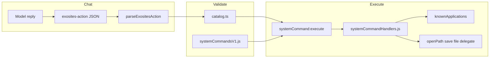

# AI actions — executor model and roadmap

This document generalizes how **allowlisted chat actions** work. Individual apps (Chrome, VS Code, etc.) are **examples** of the same pattern: a **system command ID** plus **validated args** executed in a **controlled surface** (main process or renderer). Nothing here grants “run any program with any arguments from model text.”

## Concepts

| Term | Meaning |
|------|---------|
| **System command** | A versioned ID in [`frontend/src/systemCommands/catalog.ts`](../frontend/src/systemCommands/catalog.ts) (e.g. `open_application`, `save_text_file`). |
| **Executor** | The code path after validation — branches in [`electron/ipc/systemCommandHandlers.js`](../electron/ipc/systemCommandHandlers.js) for `systemCommand:execute`, or renderer callbacks for delegated UI-only commands. |
| **`open_application` app key** | A **curated string** mapped to a **fixed launcher** in [`electron/knownApplications.js`](../electron/knownApplications.js). The model never sends paths or URLs for this command. |
| **Capability category** | Optional grouping for docs/UI: [`frontend/src/systemCommands/applicationCapabilities.ts`](../frontend/src/systemCommands/applicationCapabilities.ts). |

Command shapes and validation live in [`frontend/src/systemCommands/catalog.ts`](../frontend/src/systemCommands/catalog.ts) (renderer) and [`electron/systemCommandsV1.js`](../electron/systemCommandsV1.js) (main); there is no separate executor type module in the repo today.

## Data flow

## Security (unchanged)

- **Default deny:** unknown `commandId` or bad args → no execution.
- **No free-form paths** from the model for sensitive commands; workspace/output use **settings** or **integer indices**.
- **Audit:** [`system-command-audit.log`](AI_SYSTEM_COMMANDS.md) (see main doc).

## Roadmap

### Delivered (baseline)

- Catalog + main mirror + IPC.
- `open_application` + curated keys + [`applicationCapabilities.ts`](../frontend/src/systemCommands/applicationCapabilities.ts) groupings.
- `save_text_file` under authorized destinations.

### Phase B — Domain-specific executors (per integration)

- New **command IDs** with **strictly validated** payloads (IDs and ISO ranges, not arbitrary paths).
- **Delivered:** Cloud text uploads (`graph_onedrive_upload_text`, `google_drive_upload_text`), and **read-only** mail/calendar tools (`graph_calendar_list_events`, `graph_mail_search`, `google_calendar_list_events`, `gmail_search_messages`, `infomaniak_calendar_list_events`) executed in [`electron/ipc/systemCommandHandlers.js`](../electron/ipc/systemCommandHandlers.js); Gmail search uses [`backend/routes/assistant_routes.py`](../backend/routes/assistant_routes.py) when tokens are mirrored from Electron.

### Phase C — More third-party APIs

- Additional providers follow the same pattern: OAuth in main, tokens never in chat; extend [`INTEGRATIONS.md`](INTEGRATIONS.md) and the command catalog together.

### Phase D — Desktop automation (RPA)

- Accessibility / input simulation — **high risk**; would need separate feature flag, allowlists, and step limits.

### Phase E — Sandboxed agent

- Isolated environment for unconstrained automation — separate product scope.

## Related files

| Area | File |
|------|------|
| Threat model & user settings | [`docs/AI_SYSTEM_COMMANDS.md`](AI_SYSTEM_COMMANDS.md) |
| Command catalog | [`frontend/src/systemCommands/catalog.ts`](../frontend/src/systemCommands/catalog.ts) |
| App key labels | [`frontend/src/systemCommands/knownApplicationKeys.ts`](../frontend/src/systemCommands/knownApplicationKeys.ts) |
| Launch implementations | [`electron/knownApplications.js`](../electron/knownApplications.js) |
| Chat integration | [`AssistantReplyToolBridge`](../frontend/src/components/AssistantReplyToolBridge.tsx), [`notifyAssistantReplyComplete`](../frontend/src/systemCommands/assistantReplyNotify.ts), [`parseExositesAction.ts`](../frontend/src/systemCommands/parseExositesAction.ts) |
