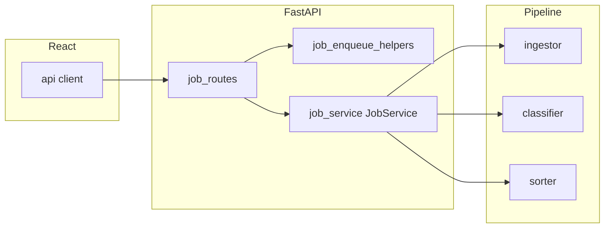

# Architecture overview — EXO

**Last updated:** 2026-04-11  
**Purpose:** Single entry for “where does X live?” and how requests flow through the system. For IPC inventory and backlog history, see [STRUCTURAL_AUDIT.md](STRUCTURAL_AUDIT.md).

## System context

Desktop-first monorepo:

- **Electron** ([`electron/main.js`](../electron/main.js)) hosts the renderer and spawns the local Python API ([`electron/backendProcess.js`](../electron/backendProcess.js)).
- **Vite + React** ([`frontend/src/`](../frontend/src/)) talks to FastAPI over HTTP (`127.0.0.1:7799` by default).
- **FastAPI** ([`backend/main.py`](../backend/main.py)) composes routers, `app.state` (jobs, `JobService`, history, context index), and the sort/classify pipeline.

Optional **cloud** services are not required for local desktop use. See [Cloud (account API)](#cloud-account-api) below.

## Cloud (account API)

| Path | Role | Status |
|------|------|--------|
| [`cloud-node/`](../cloud-node/) | **Canonical** Node.js account API for **api.exosites.ch** (auth, `/v1/me`, crash ingest, social sign-in). Matches [`electron/cloudAuth.js`](../electron/cloudAuth.js). | Active — all new cloud work lands here. |

The legacy Python `cloud/` stack was removed (2026-06); see [CLOUD_INVENTORY.md](./CLOUD_INVENTORY.md).

## Request flow (sort / analyze job)

1. Renderer calls `POST /analyze`, `POST /sort`, `POST /analyze-upload`, `POST /analyze/with-sources`, etc. ([`backend/routes/job_routes*.py`](../backend/routes/)).
2. Routes validate input, expand paths or save uploads, then call **`JobService.analyze_files`** or **`JobService.apply_files`** ([`backend/job_service.py`](../backend/job_service.py)).
3. Analyze path uses **`ingestor.extract_text` / `extract_content`**, **`classifier.classify_*`**, **`sorter`** helpers as injected callables from [`backend/main.py`](../backend/main.py).

**Google Drive (desktop):** Chosen files are not sent over HTTP to Google from the Python API for sorting. The Electron main process calls **`integrationImportGoogleDriveFiles`** ([`electron/integrations/ipc.js`](../electron/integrations/ipc.js)), downloads or exports to a per-run staging directory under the app’s **user data**, and returns **absolute `localPaths`**. The renderer passes those paths into **`POST /analyze`** or **`POST /analyze/with-sources`** (optional `gmail` slice for a combined run). Browsing uses **`integrationListGoogleDriveFiles`**. See [INTEGRATIONS.md](INTEGRATIONS.md#google-workspace--sort).

## Backend entry and routers

| Concern | Location |
|--------|----------|
| App factory + lifespan wiring | [`backend/main.py`](../backend/main.py) — `_build_app()` / `create_app()`; production uses module-level `app` |
| Job HTTP (analyze, sort, apply, uploads, lifecycle) | [`backend/routes/job_routes.py`](../backend/routes/job_routes.py) composes [`job_routes_analyze.py`](../backend/routes/job_routes_analyze.py), [`job_routes_lifecycle.py`](../backend/routes/job_routes_lifecycle.py) |
| Shared enqueue helpers | [`backend/routes/job_enqueue_helpers.py`](../backend/routes/job_enqueue_helpers.py) |
| Gmail OAuth + import | [`backend/routes/gmail_routes.py`](../backend/routes/gmail_routes.py) |
| History, meta, Ollama | [`backend/routes/history_routes.py`](../backend/routes/history_routes.py), [`meta_routes.py`](../backend/routes/meta_routes.py), [`ollama_routes.py`](../backend/routes/ollama_routes.py) |
| FastAPI dependencies | [`backend/deps.py`](../backend/deps.py) — `get_jobs`, `get_job_service`, … from `request.app.state` |

## Environment and Gmail OAuth

| Step | Location |
|------|----------|
| Load `.env` before other imports | [`backend/dotenv_bootstrap.py`](../backend/dotenv_bootstrap.py) — `load_dotenv_early(main_file=__file__)` from `main.py` |
| Candidate paths | Next to `main.py` → `backend/.env`, repo root `.env`, frozen exe parent (if frozen), `~/.ai-file-sorter/.env` |
| Gmail-specific override | `refresh_gmail_oauth_env_from_dotenv` on `/gmail/status` so parent placeholders do not block `backend/.env` |
| Client credentials + token flow | [`backend/gmail_google_oauth.py`](../backend/gmail_google_oauth.py) |

**Dev vs packaged:** Electron dev spawns `python -m uvicorn main:app` with `cwd` = `backend/` ([`electron/backendProcess.js`](../electron/backendProcess.js)). Packaged app runs `backend.exe` with `EXOSITES_USER_DATA` set to Electron userData; prefer user-level `.env` or `~/.ai-file-sorter/gmail_oauth_client.json` when the extracted app dir has no project `backend/.env`.

**Bundled Gmail client (releases):** If `gmail_oauth_client.json` sits next to `backend.exe` under `process.resourcesPath`, Electron sets `EXOSITES_GOOGLE_OAUTH_CLIENT_JSON` for the child (unless the user already set client id/secret or a JSON path). The manual packager copies `electron/resources/gmail_oauth_client.json` when that file exists before packaging. End users then open **External sources**, click **Connect Gmail**, approve in the system browser, and tokens are stored under `~/.ai-file-sorter/` on the machine.

## Ports and constants

| Constant | Value | Where |
|----------|-------|--------|
| Backend HTTP | `7799` | [`backend/constants.py`](../backend/constants.py) `BACKEND_PORT`, [`electron/constants.js`](../electron/constants.js), [`frontend/src/constants.ts`](../frontend/src/constants.ts) |
| Gmail OAuth loopback | `8789` (default) | [`backend/gmail_google_oauth.py`](../backend/gmail_google_oauth.py) `EXOSITES_GMAIL_OAUTH_PORT` |

Frontend API base: [`frontend/src/api/client.ts`](../frontend/src/api/client.ts) — `VITE_API_BASE` or `http://127.0.0.1:${BACKEND_PORT}`.

## Smoke checklist (after refactors or releases)

1. `GET http://127.0.0.1:7799/health` — 200.
2. `GET http://127.0.0.1:7799/gmail/status` — JSON with `oauth_configured`, `connected` (values depend on local setup).
3. Start a small **analyze** job from the UI (or `POST /analyze` with known paths) and confirm job reaches `awaiting_approval` or completes per settings.

## Frontend API layout

HTTP clients live under [`frontend/src/api/`](../frontend/src/api/): [`client.ts`](../frontend/src/api/client.ts), [`jobs.ts`](../frontend/src/api/jobs.ts), [`gmail.ts`](../frontend/src/api/gmail.ts), [`index.ts`](../frontend/src/api/index.ts) re-exports the `api` object.

## Tests and the app factory

Use **`TestClient(main.app)`** and **`main.jobs`** when tests patch `main.*` or share the process singleton. Use **`create_app()`** from [`backend/main.py`](../backend/main.py) for an isolated `FastAPI` instance with its own `app.state`.

## Electron IPC manifest

Invoke channels exposed on `window.electronAPI` are listed in [`electron/api-channels.manifest.json`](../electron/api-channels.manifest.json). Root `npm run test:electron` runs [`scripts/validate-electron-ipc-manifest.cjs`](../scripts/validate-electron-ipc-manifest.cjs) so each channel has a matching `ipcMain.handle` in `electron/**/*.js`.

## i18n key parity

The frontend enforces key parity across `en`, `de`, `fr`, and `it` via [`frontend/src/i18n/localeKeyParity.test.ts`](../frontend/src/i18n/localeKeyParity.test.ts). Run `npm run check-locale-keys` from [`frontend/`](../frontend/) (or `npm test` in that package) after adding or renaming translation keys.

## Adding an IPC channel

Invoke channels on `window.electronAPI` must stay in sync across four places. CI runs `npm run test:electron`, which includes [`scripts/validate-electron-ipc-manifest.cjs`](../scripts/validate-electron-ipc-manifest.cjs).

### Checklist

1. **Handler (main process)** — Add `ipcMain.handle("namespace:action", …)` in the appropriate module under [`electron/ipc/`](../electron/ipc/) (or [`electron/integrations/`](../electron/integrations/) for OAuth/import). Register the module from [`electron/ipcHandlers.js`](../electron/ipcHandlers.js) if it is a new file.

2. **Manifest** — Append the exact channel string to `channels` in [`electron/api-channels.manifest.json`](../electron/api-channels.manifest.json). Use `mainOnly` only for channels invoked from main → main (not exposed on preload).

3. **Preload** — Expose a typed method on `contextBridge.exposeInMainWorld("electronAPI", …)` in [`electron/preload.js`](../electron/preload.js) that calls `ipcRenderer.invoke("namespace:action", …)`.

4. **Renderer types** — Extend [`frontend/src/types/electron.d.ts`](../frontend/src/types/electron.d.ts) so TypeScript matches the preload surface.

5. **Validate** — From repo root: `node scripts/validate-electron-ipc-manifest.cjs` (or `npm run test:electron`).

### Naming

- Channel names: `domain:verbNoun` (e.g. `dialog:openDirectory`, `integration:listGoogleDriveFiles`).
- Preload methods: camelCase without the domain prefix when obvious (`openDirectory`, `getBackendToken`).

### Failure modes the validator catches

| Symptom | Fix |
|---------|-----|
| Preload invokes channel missing from manifest | Add to `channels` or `mainOnly` |
| Manifest entry with no `ipcMain.handle` | Implement handler or remove stale manifest line |
| Orphan manifest entry (warning) | Remove or mark `mainOnly` if main-only |

Task traceability: P0-0.1.* in [REMEDIATION_PLAN.md](REMEDIATION_PLAN.md).

## Related docs

- [README.md](README.md) — doc index.
- [ASSISTANT_RESTRUCTURE_PLAN.md](ASSISTANT_RESTRUCTURE_PLAN.md) — phased assistant unification (**Phases 0–8 complete**).
- Assistant ADRs: [009](adr/009-assistant-conversation-source-of-truth.md)–[012](adr/012-assistant-provider-routing.md).
- [STRUCTURAL_AUDIT.md](STRUCTURAL_AUDIT.md) — inventory, IPC table, test gaps, historical backlog.
- [AI_ACTIONS_ARCHITECTURE.md](AI_ACTIONS_ARCHITECTURE.md) — system commands / allowlisted actions.
- [QUALITY_GATES.md](QUALITY_GATES.md) — commands to run before merge/release.
- [SECURITY.md](SECURITY.md) — threat model (localhost, XSS, secrets, WebSocket auth).
