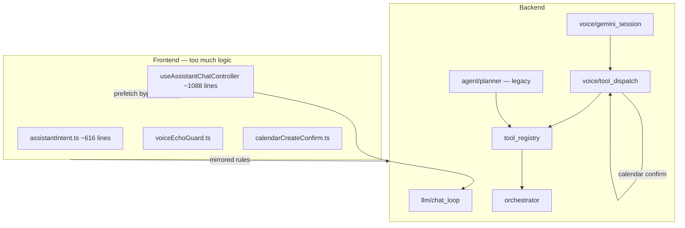
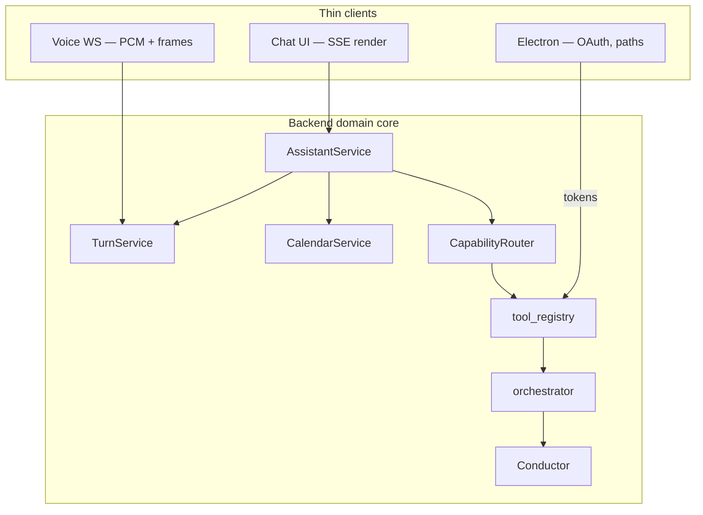

# Assistant restructure plan — complete handoff

**Created:** 2026-06-18  
**Status:** Phases 0–8 complete (engineering)  
**Audience:** Engineers or agents continuing this work  
**Related:** [`ARCHITECTURE.md`](ARCHITECTURE.md), [`ARCHITECTURE_AGENT_EXECUTION.md`](ARCHITECTURE_AGENT_EXECUTION.md), [`VOICE.md`](VOICE.md), [`adr/009-assistant-conversation-source-of-truth.md`](adr/009-assistant-conversation-source-of-truth.md)

### Implementation status (2026-06-18)

| Phase | Status | Notes |
|-------|--------|-------|
| 0 ADRs | Done | `docs/adr/009`–`012` (plan body references 009–012, not 001–004) |
| 1 Provider context | Done | `provider_context.py`, failover tests |
| 2 CalendarService | Done | `services/calendar/`; flag `ASSISTANT_CALENDAR_SERVICE` gates REST + confirm flow |
| 3 TurnService | Done | `services/turn/`; flag `ASSISTANT_TURN_SERVICE` disables echo/junk filters |
| 4 CapabilityRouter | Done | `services/routing/` |
| 5 Thin client | Done | `POST /assistant/turn`, controller ~229 lines; `runAssistantSendMessage` split; shared intent golden parity; `assistantIntentHelpers` retained for IPC prefetch fallback only |
| 6 One planner | Done | `orchestrator_runner.py`, flag `ASSISTANT_ORCHESTRATOR_TASK_QUEUE` |
| 7 App split | Done | `apps/workspace/` hooks; `useWorkspaceBatch` split; `AppMainWorkspace` ~379 lines; props in `appMainWorkspaceTypes.ts` |
| 8 Tool registry split | Done | `declarations/` + `assemble.py` |

### Engineering completion (2026-06-18)

- `npm run quality` green: 12/12 e2e, vitest, pytest
- Branch: `feat/assistant-restructure` — commits `7724858`, `1c8e966`, `b3fd46f`
- Remaining non-engineering: PR merge, counsel sign-off (`docs/COUNSEL_REVIEW_PACKET.md`)
- Documented follow-up (low priority): `assistantIntentHelpers.ts` IPC prefetch fallback until server prefetches all panel hints
- **Next feature:** recurring calendar delete scope — **implemented**; see [`CALENDAR_RECURRING_DELETE_PLAN.md`](CALENDAR_RECURRING_DELETE_PLAN.md)

---

## How to use this in a new chat

Paste or attach this file and say:

> Execute **Phase N** of `docs/ASSISTANT_RESTRUCTURE_PLAN.md`. Do not skip acceptance criteria. Run tests after each phase.

Work **one phase at a time**. Each phase has explicit file targets, acceptance criteria, and tests. Do not start Phase 2 until Phase 1 acceptance passes.

---

## Why this plan exists

Recent production bugs were **symptoms of architecture**, not isolated defects:

| User-visible bug | Root cause |
|------------------|------------|
| Duplicate calendar recap bubbles | Same utterance processed by tool path **and** confirm-at-`turn_complete` path |
| Partial / missing user bubbles | Dual commit paths (server + client guards) + Gemini STT |
| `Oui` / `Yes` confirm fails | Model re-calls `create_calendar_event` with `"Oui."` before confirm handler |
| Bulk calendar delete fails | Model chose `plan_and_execute` instead of `google_workspace`; planner hit Anthropic 404 with no failover to user's Gemini |
| Text vs voice calendar differ | Three implementations: voice tools, `calendarCreateConfirm.ts`, `/integrations/calendar/events` |

**Pattern:** defense-in-**duplication** — every bug gets a guard in Python **and** TypeScript instead of one authoritative layer.

---

## North star

**One execution spine. Thin clients. Server authority for anything that mutates state.**

```
User intent → policy → tool(s) → outcome → one commit to conversation
```

The spine already exists:

- `tool_registry.dispatch_sync` — integration layer
- `orchestrator.orchestrate` — multi-step only
- `orchestrator.conductor` — provider failover

The assistant surface must **stop growing parallel routers** beside this spine.

---

## Current vs target architecture

### Current (simplified)



### Target



---

## Design principles (non-negotiable)

1. **Server is authoritative** for transcripts, confirm state, tool results, and turn commits.
2. **Frontend renders state** — no 600-line regex intent router in the renderer.
3. **One schema per domain** — calendar draft/confirm shared across voice, text, API.
4. **Tools are the product API** — new capability = declaration + handler, not a new frontend branch.
5. **Orchestrator is opt-in** — only genuinely multi-step goals (≥2 distinct tools or cross-domain).
6. **User's active provider is always `preferred`** for planning, reasoning, and chat relay.
7. **Invalid model (404) fails over** to the next configured provider, same as rate limits.

---

## Phase 0 — ADRs and boundaries (1–2 days)

**Goal:** Freeze rules before moving code. No behavior change.

### Deliverables

Create these short docs under `docs/adr/`:

| ADR | Contents |
|-----|----------|
| `009-assistant-conversation-source-of-truth.md` | Client owns live UI (`localStorage`); server mirrors + distills; conflict = client wins for display, server wins for memory extraction |
| `010-assistant-voice-turn-contract.md` | See **Turn contract** section below — canonical spec |
| `011-assistant-when-to-orchestrate.md` | Use `plan_and_execute` only when goal needs ≥2 tool domains or chained reasoning; calendar CRUD is never orchestrated |
| `012-assistant-provider-routing.md` | User `aiProvider` + `chatModel` passed to all Conductor calls; env keys are fallbacks only |

### Acceptance

- [x] Four ADR files exist and are linked from `docs/ARCHITECTURE.md` (`009`–`012`)
- [x] Team agrees: no new frontend intent branches without ADR amendment (process)

---

## Phase 1 — Provider context + failover (2–3 days)

**Goal:** Fix `plan_and_execute` Anthropic 404 when user runs Gemini-only.

### Tasks

1. **`backend/orchestrator/complete.py`**
   - Treat HTTP 404 / `model not found` / invalid model as failover-eligible (not hard stop).
   - Add markers to `is_transient_error` or a sibling `is_failover_error` for 404 model errors.

2. **`backend/orchestrator/health.py`**
   - Document that 404 model errors relay to next candidate.

3. **`backend/actions/agent_task.py`**
   - Accept optional `preferred`, `preferred_model`, `preferred_api_key` in parameters (or read from `request_context` / session).
   - Pass into `orchestrate` via injected `reason_fn` that calls `complete(..., preferred=...)`.

4. **`backend/voice/tool_dispatch.py`**
   - When spawning `plan_and_execute`, inject voice session's active provider credentials (same as chat).

5. **`backend/llm/chat_loop.py`**
   - Ensure agent tool calls inherit chat request provider (verify, fix if missing).

6. **Tests**
   - `test_complete_failover_on_404_model` — anthropic 404 → gemini succeeds.
   - `test_plan_and_execute_uses_preferred_provider` — gemini user never calls anthropic when anthropic would 404.

### Acceptance

- [ ] Voice delete goal with only Gemini configured plans via Gemini (or fails with actionable message, not Anthropic 404).
- [ ] Existing orchestrator tests pass.
- [ ] No regression in chat relay behavior.

### Key files

- `backend/orchestrator/complete.py`
- `backend/orchestrator/health.py`
- `backend/actions/agent_task.py`
- `backend/voice/tool_args.py`
- `backend/connector_credentials.py`

---

## Phase 2 — CalendarService unification (4–5 days)

**Goal:** One calendar create/confirm/delete flow for voice, text, and REST.

### New module

```
backend/services/calendar/
  __init__.py
  draft.py          # CalendarCreateDraft, build, patch, missing fields
  confirm.py        # parse confirm/reject/patch, recap format
  service.py        # CalendarService: create_with_confirm, execute_confirmed, bulk_delete
  schemas.py        # Pydantic models for API responses
```

Migrate from:

- `backend/voice/calendar_create_confirm.py`
- `backend/voice/calendar_create_args.py`
- `backend/routes/calendar_routes.py` (thin handler → service)

### API contract (shared)

```json
{
  "status": "needs_confirmation | needs_input | created | cancelled | failed",
  "recap": "demain à 15h, 1 heure — … Je crée l'événement ?",
  "draft": { "summary", "start", "end", "tool_name" },
  "missing": "time | title | null"
}
```

### Rules (already learned from bugs)

- Repeat of `draft.source_text` at `turn_complete` → **NONE**, not PATCH.
- `à 15h` is a time token, not a location patch.
- `needs_confirmation` is `ok: true` for promise guard — not a tool failure.
- Confirm at **tool_call time** when pending draft exists and user says Oui/Yes.

### Frontend

- `calendarCreateConfirm.ts` becomes a **thin client** over API types (or delete and use shared JSON schema).
- Remove duplicate confirm logic from `useAssistantChatController.ts` where possible.

### Tests

- Port all `test_voice_calendar_create_confirm.py` cases to `test_calendar_service.py`.
- Add bulk delete integration test (mock Google API).

### Acceptance

- [ ] Voice calendar create: one recap, confirm works, event in Google Calendar.
- [ ] Text calendar create uses same service (via tool or `/integrations/calendar/events`).
- [ ] No duplicated recap when full sentence committed at `turn_complete`.
- [ ] `calendar_create_confirm.py` is a thin re-export or deleted.

---

## Phase 3 — TurnService (server authority) (3–4 days)

**Goal:** Single turn policy; shrink client duplication.

### New module

```
backend/services/turn/
  __init__.py
  commit.py         # resolve_user_turn_at_complete (from turn_commit.py)
  echo.py           # from voice_echo_guard.py
  quality.py        # from voice_transcript_quality.py
  promise.py        # from voice_promise_guard.py
  service.py        # TurnService.commit(turn_complete_payload) → TurnCommitResult
```

### Turn contract (canonical — implement exactly)

```python
@dataclass
class TurnCommitResult:
    user_text: str
    assistant_text: str
    user_committed: bool
    drop_reason: str | None  # junk | echo | empty
    user_text_raw: str | None
    tool_meta: ToolTurnMeta | None
```

**Rules:**

1. Only `turn_complete` (or explicit server event) commits user bubbles.
2. Client `appendVoiceTurnMessages` uses `serverTurn` when present — never re-filters committed text.
3. Client dedupe of assistant bubbles is **cosmetic only** (exact + near-identical recaps).
4. Echo guard uses **prior assistant lines only** at commit time.

### Frontend cleanup

- Mark `voiceEchoGuard.ts`, `voiceTranscriptQuality.ts` as deprecated.
- Client guards only apply when `serverTurn` is absent (legacy / offline).
- Single golden fixture: `backend/tests/fixtures/voice_transcript_golden.json` — frontend tests import or duplicate via CI sync check.

### Acceptance

- [ ] All `test_voice_echo_guard.py`, `test_voice_turn_commit.py`, `test_voice_transcript_golden.py` pass against `TurnService`.
- [ ] Frontend voice commit tests pass with server-authoritative payloads.
- [ ] No new duplicated guard logic in TypeScript.

---

## Phase 4 — CapabilityRouter (3–4 days)

**Goal:** Stop wrong tool selection (e.g. `plan_and_execute` for bulk calendar delete).

### New module

```
backend/services/routing/
  capability_router.py
```

### Routing table

| Signal | Route to | Not |
|--------|----------|-----|
| `create_calendar_event` + complete draft | `CalendarService.create_with_confirm` | raw API |
| User confirms pending calendar draft | `CalendarService.execute_confirmed` | new create call |
| `delete` + calendar + list already fetched | `google_workspace` batch `delete_calendar_event` | `plan_and_execute` |
| List calendar events | `google_workspace` `list_calendar_events` | `plan_and_execute` |
| ≥2 domains or explicit multi-step goal | `plan_and_execute` with user provider | direct tools |
| Single integration op | Direct tool | orchestrator |

### Integration points

- `backend/voice/tool_dispatch.py` — call router before `_resolve_calendar_create_tool_result` and before allowing `plan_and_execute`.
- `backend/voice/tool_args.py` — `resolve_voice_tool_call` redirects (extend existing).
- `backend/voice_instructions.py` — shorten; router enforces policy in code.

### Tests

- Bulk delete request → `google_workspace` delete ops, not `plan_and_execute`.
- Simple create → confirm flow, not orchestrator.
- Complex goal ("research emails then schedule meeting") → `plan_and_execute`.

### Acceptance

- [ ] Reproduce voice "delete all WORK events" → uses Google calendar delete path.
- [ ] `test_voice_tool_redirect.py` extended for delete routing.

---

## Phase 5 — Thin assistant client (5–7 days)

**Goal:** Collapse `useAssistantChatController` and `assistantIntent.ts`.

### Backend

New endpoint (name flexible):

```
POST /assistant/turn
  body: { message, conversation_id, provider, model, ... }
  returns: SSE or JSON { messages[], tool_events[], prefetch? }
```

Move into backend:

- Mail recap prefetch
- Calendar write/read prefetch (via `CalendarService`)
- Agent task kickoff (orchestrator with provider)
- Codegen studio routing

Keep `classifyIntent` only for **UI hints** (which panel to open), not for bypassing LLM.

### Frontend target structure

```
frontend/src/features/assistant/
  chat/
    useAssistantChatController.ts   # <200 lines — orchestrates submodules
    assistantChatStreamer.ts        # SSE only
    voiceTurnCommitter.ts           # wraps commitAssistantTurn
  voice/
    useVoiceSession.ts              # unchanged surface
  # DELETE or gut: systemCommands/assistantIntent.ts prefetch branches
```

### Acceptance

- [x] `useAssistantChatController.ts` under 250 lines.
- [x] `assistantIntent.ts` under 150 lines (UI routing only) or removed.
- [x] Text calendar create/delete uses same backend path as voice.
- [x] All existing assistant chat tests pass or are migrated.

---

## Phase 6 — Retire duplicate planner stack (4–5 days)

**Goal:** Execute migration in `ARCHITECTURE_AGENT_EXECUTION.md`.

### Tasks

1. `agent/task_queue.py` — call `orchestrator.orchestrate` instead of `agent/planner.plan_goal`.
2. `agent/plan_mirror.py` — translate orchestrator progress → visualizer SSE events.
3. Deprecate `agent/planner.py` and `agent/executor.py` planning paths (keep executor only if still needed for subtask shape).
4. Update `docs/ARCHITECTURE_AGENT_EXECUTION.md` — mark migration complete.

### Acceptance

- [x] Tesseract visualizer still receives `plan_ready`, `step_start`, `step_done` with same shape.
- [x] `/agent/task` and `plan_and_execute` share one planning engine.
- [x] `test_agent_plan.py` updated.

---

## Phase 7 — Product split: Workspace vs Assistant (ongoing)

**Goal:** Reduce `AppShell.tsx` blast radius.

### Target

```
frontend/src/apps/
  workspace/     # Queue, sort, jobs — useWorkspaceBatch, QueuePanel
  assistant/     # ExoPanel, voice, chat, memory, tasks
  shared/        # settings shell, auth, desktopClient
```

### Bridge API (replace ref coupling)

```typescript
// shared/bridges/workspaceAssistant.ts
export interface WorkspaceAssistantBridge {
  onSortComplete?: (summary: SortSummary) => void;
  openAssistantWithContext?: (ctx: AssistantContext) => void;
}
```

### Acceptance

- [x] `AppShell.tsx` under 400 lines (composition only).
- [x] `AppMainWorkspace.tsx` under 400 lines (composition + layout only).
- [x] No direct `workspaceVoiceRunBatchRef` from assistant into workspace internals.

---

## Phase 8 — Tool registry split (2–3 days, can parallelize)

**Goal:** Stop editing an 877-line declarations file for every tool.

```
backend/tool_registry/
  declarations/
    __init__.py
    calendar.py
    integrations.py
    system.py
    memory.py
  assemble.py       # build_live_tools(), build_chat_tool_specs()
  dispatch.py       # unchanged
  handlers.py       # unchanged
```

### Acceptance

- [x] `declarations.py` deleted (replaced by `declarations/` package + `assemble.py`).
- [x] Adding a tool touches one domain file + handler only.

---

## Test strategy (all phases)

| Layer | What to run |
|-------|-------------|
| Unit | `pytest backend/tests/test_*voice* backend/tests/test_*calendar* backend/tests/test_orchestrator*` |
| Frontend | `vitest run src/features/assistant src/utils/calendarCreateConfirm.test.ts` |
| Manual voice | French create → single recap → oui → Google event; bulk WORK delete |
| Manual text | Same calendar flows via typed chat |

**CI gate:** No phase merges without green voice calendar tests + orchestrator failover test.

---

## Feature flags (rollout)

| Flag | Phase | Purpose |
|------|-------|---------|
| `ASSISTANT_PROVIDER_CONTEXT=1` | 1 | Pass user provider to orchestrator |
| `ASSISTANT_CALENDAR_SERVICE=1` | 2 | Route calendar through `CalendarService` |
| `ASSISTANT_TURN_SERVICE=1` | 3 | Server-only turn commit |
| `ASSISTANT_CAPABILITY_ROUTER=1` | 4 | Tool routing table |
| `ASSISTANT_UNIFIED_TURN=1` | 5 | `POST /assistant/turn` replaces prefetch |
| `ASSISTANT_ORCHESTRATOR_TASK_QUEUE=1` | 6 | `/agent/task` uses orchestrator |

All flags default **on** in code (unset env = enabled). Set `=0` to roll back. See `backend/.env.example`.

---

## What NOT to do

- **Microservices** — desktop monorepo stays.
- **Rewrite voice on a new stack** — Gemini Live + `tool_registry` stays.
- **More frontend regex routing** — opposite of goal.
- **Prompt-only fixes** for tool choice — routing is code (`CapabilityRouter`).
- **Big-bang rewrite** — one phase per PR.
- **Duplicate guards in TS and Python** — delete client copy after server authority.

---

## 90-day priority order

| Week | Phase | Outcome |
|------|-------|---------|
| 1 | 0 + 1 | ADRs + Gemini-only delete planning works |
| 2–3 | 2 | Calendar bugs class eliminated |
| 4 | 3 | Turn contract authoritative |
| 5 | 4 | Wrong tool selection fixed |
| 6–7 | 5 | Thin client, backend router |
| 8 | 6 | One planner stack |
| 9+ | 7–8 | Shell split + tool registry split |

---

## Key files reference

### Backend — voice

- `backend/voice/gemini_session.py`
- `backend/voice/tool_dispatch.py`
- `backend/voice/turn_commit.py`
- `backend/voice/calendar_create_confirm.py`
- `backend/voice/tool_args.py`
- `backend/voice_instructions.py`

### Backend — chat & orchestration

- `backend/llm/chat_loop.py`
- `backend/actions/agent_task.py`
- `backend/orchestrator/agents.py`
- `backend/orchestrator/complete.py`
- `backend/orchestrator/conductor.py`
- `backend/agent/task_queue.py`

### Backend — tools

- `backend/tool_registry/assemble.py`
- `backend/tool_registry/declarations/`
- `backend/tool_registry/dispatch.py`
- `backend/actions/google_workspace_tool.py`

### Frontend — assistant

- `frontend/src/features/assistant/chat/useAssistantChatController.ts`
- `frontend/src/features/assistant/chat/commitAssistantTurn.ts`
- `frontend/src/systemCommands/assistantIntent.ts`
- `frontend/src/utils/calendarCreateConfirm.ts`
- `frontend/src/voice/useVoiceSession.ts`
- `frontend/src/voice/voiceFrameRouter.ts`

### Docs

- `docs/VOICE.md` — update after Phase 3
- `docs/ARCHITECTURE_AGENT_EXECUTION.md` — update after Phase 6

---

## Success metrics

| Metric | Before | Target |
|--------|--------|--------|
| Duplicate assistant recap rate | Reproducible | 0 in voice calendar flow |
| Calendar confirm success (voice) | Intermittent | >95% manual QA |
| Wrong tool for bulk delete | `plan_and_execute` | `google_workspace` |
| `useAssistantChatController` lines | ~1088 | <250 |
| Python/TS duplicated guard modules | 4+ pairs | 0 (server only) |
| Planner implementations | 2 | 1 ✅ |

---

## Post-completion verification (2026-06-18)

```bash
# Full release gate (lint, knip, build, vitest, pytest, playwright)
npm run quality

# Backend — voice, calendar, orchestrator, unified turn
cd backend && python -m pytest -q \
  tests/test_agent_plan.py \
  tests/test_assistant_turn.py \
  tests/test_tool_registry_assemble.py \
  tests/test_capability_router.py \
  tests/test_turn_service.py \
  tests/test_provider_context_failover.py \
  tests/test_voice_ws_auth.py

# Frontend — assistant + apps split + conversation sync guard
cd frontend && npx vitest run \
  src/features/assistant \
  src/apps \
  src/hooks/useConversations.persist.test.ts \
  src/systemCommands/assistantIntent.test.ts

# E2E smoke (12 specs — includes assistant chat + voice PTT)
cd frontend && npx playwright test
```

**Post-hardening (2026-06-18):** Fixed assistant chat ↔ conversation store infinite update loop via `conversationPersistedMessagesEqual` + guarded sync in `useAssistantChatController`. Regression: `useConversations.persist.test.ts`.

Feature flags default **on** (set `=0` to disable). See `backend/.env.example`.

---

*Plan complete. For regressions, run the verification block above before merge.*

