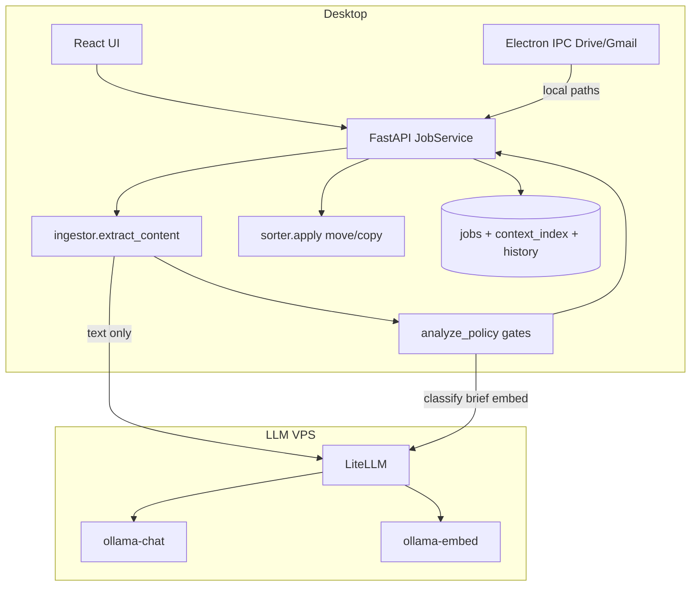
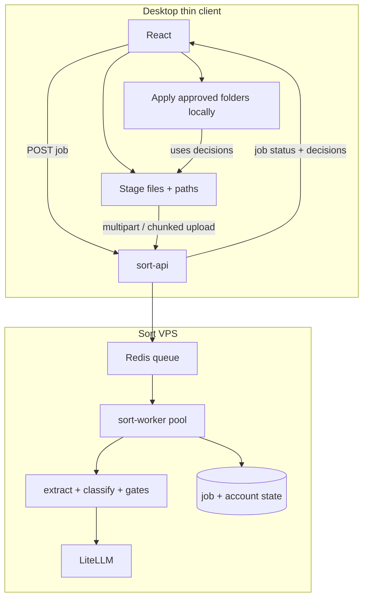

# Plan — full cloud sort on the VPS

**Goal:** All **sort work** (OCR, ffmpeg, extract, classify, gates) runs on Exo VPS; the desktop is a **thin client** (auth, upload, review UI, local apply).

**North star:** User drops files → gets correct folders → fixes exceptions only. No local Tesseract, ffmpeg, or analyze pipeline on the user's machine for subscribed cloud sort.

**Status:** Planning doc (2026-06). LLM inference is already on VPS; **extract + JobService analyze loop** are still local — this plan moves them.

Related: [`CLOUD_ARCHITECTURE.md`](CLOUD_ARCHITECTURE.md), [`CLOUD_LLM_ONLY.md`](CLOUD_LLM_ONLY.md), [`CLOUD_EXTRACTION_AUDIT.md`](CLOUD_EXTRACTION_AUDIT.md), [`CAPACITY_BASELINE.md`](CAPACITY_BASELINE.md), [`ARCHITECTURE.md`](ARCHITECTURE.md)

---

## 0. Senior agent prompt (copy into Cursor)

Use this prompt to implement or review work toward **full sort on VPS**. Follow phases in order; do not skip Phase 0 privacy lock before enabling upload in production.

### Full prompt

**Objective:** Move **all sort compute** to the Exo LLM VPS — **Tesseract OCR, ffmpeg, PDF/DOCX parse, vision supplement, classify, semantic rerank, analyze_policy gates, document briefing** — while the desktop only stages files, uploads bytes, polls job status, and **apply**s move/copy locally.

**Read first (verify in repo, do not assume):**
- [`docs/CLOUD_SORT_VPS_PLAN.md`](CLOUD_SORT_VPS_PLAN.md) (this doc)
- [`docs/CLOUD_ARCHITECTURE.md`](CLOUD_ARCHITECTURE.md), [`infra/llm/README.md`](../infra/llm/README.md)
- Pipeline: `backend/job_service/_impl.py`, `backend/ingestor.py`, `backend/analyze_policy.py`, `backend/classifier.py`
- Credentials: `electron/entitlement/sortCredentials.js`, `infra/llm/sort-credentials-broker/`
- Capacity: [`docs/CAPACITY_BASELINE.md`](CAPACITY_BASELINE.md), `scripts/ga-sort-capacity-baseline.sh`

**Target split:**

| Runs on VPS | Stays on desktop |
|-------------|------------------|
| Ephemeral file upload + delete (TTL ≤ 15 min after job terminal) | File paths, Drive/Gmail OAuth + download to staging |
| Tesseract, ffmpeg, ingestor extract | Apply: move/copy to output folder |
| Full analyze row (brief → classify → rerank → gates) | Review UI, bulk approve, exception fixes |
| Job state (Postgres on LLM VPS) | Optional local cache; not source of truth when `sort_service_mode=cloud_full` |
| Context index per account (sync snapshot) | Electron IPC, local backend token |

**Deliverables by phase (implement one slice per PR):**

| Phase | Ship | Verify |
|-------|------|--------|
| **0** | Privacy/Terms note + max upload size + threat model doc | PM sign-off — no prod upload without this |
| **1** | `infra/llm/sort-worker/` extract API (`POST /v1/sort/extract`); Docker with tesseract + ffmpeg; `backend/cloud_extract.py` + `EXOSITES_CLOUD_EXTRACT=1` | Contract tests vs local `extract_content`; staging 50-file corpus |
| **2** | `sort-api` + worker pool: job CRUD, upload file → full `_analyze_one_file` logic; shared `exo-sort-core` package; Postgres `sort_jobs` / `sort_files` | Regression fixtures on VPS; schema matches `frontend/src/api/jobSchemas.ts` |
| **3** | `sort_service_mode=cloud_full` from broker; desktop proxy + chunked upload; local FastAPI apply-only; hide Tesseract install gates | `TESTING_PHASE_CHECKLIST.md` Phase D; zero local tesseract during sort |
| **4** | Compose overlay, Prometheus metrics, tmp sweeper cron, runbooks | Extended capacity baseline with upload MB; p95 ≤ 2× classify-only at 5 users |

**Constraints (non-negotiable):**
- **No local sort work in production** when `cloud_full`: no `ingestor.extract_content` on desktop for entitled users.
- **No synthetic upload progress** — bytes uploaded / total from HTTP only (`progress-and-loading.mdc`).
- **Schema sync** — Pydantic job models, Zod `jobSchemas.ts`, VPS API OpenAPI in one PR per contract change (`schema-sync.mdc`).
- **Security** — multi-tenant job IDs; sanitize uploads; no paths/filenames in telemetry; auth via broker virtual key or JWT scope; loopback rules unchanged for local FastAPI proxy.
- **Resource isolation** — extract workers separate from `ollama-chat` containers; scale workers on queue depth, LLM on existing [`CAPACITY_BASELINE.md`](CAPACITY_BASELINE.md) knobs.
- **Do not** put sort file blobs in MariaDB (`api.exosites.ch`); Postgres on LLM VPS or tmpfs only.

**Acceptance (GA):**
1. 100 mixed files sorted with **no local Tesseract/ffmpeg** processes during analyze.
2. Upload bytes deleted ≤ 15 min after job reaches terminal state (automated audit).
3. p95 upload+extract+classify ≤ 2× current classify-only p95 at 5 concurrent users.
4. Apply still works offline-after-decisions (folders returned before local move).
5. [`docs/SORT_GA_GATES.md`](SORT_GA_GATES.md) updated.

**Output format for each work session:**
1. Phase + slice scope (one paragraph)
2. Files touched (table)
3. API/schema changes (if any)
4. VPS compose/resource impact
5. Tests run + pass/fail
6. Manual QA steps (numbered)
7. Risks / follow-ups

**Anti-patterns (reject in review):**
- “Install Tesseract locally” for cloud subscribers
- Running extract inside Ollama container
- Duplicating gate logic on desktop when VPS worker exists
- Permanent file storage on VPS without retention policy
- Moving `127.0.0.1:7799` to public internet instead of thin-client proxy

---

### Short prompt (single agent turn)

> Implement the next slice of [`docs/CLOUD_SORT_VPS_PLAN.md`](CLOUD_SORT_VPS_PLAN.md): move **sort work** (OCR, ffmpeg, extract, classify, gates) to the LLM VPS; desktop uploads ephemeral files and applys locally only. Reuse `backend/ingestor` + `job_service/_impl` + `analyze_policy` in `infra/llm/sort-worker`; add Postgres job state on LLM VPS; auth via sort-credentials broker; feature-flag rollout (`EXOSITES_CLOUD_EXTRACT` → `sort_service_mode=cloud_full`). Follow phase order, schema-sync, no synthetic progress, separate extract workers from Ollama, verify with pytest + staging capacity baseline. Output: scope, files, API diff, ops impact, tests, QA steps.

---

## 1. Current architecture (as-built)

### Three hosts

| Host | Stack | Sort role today |
|------|--------|-----------------|
| **Desktop** | Electron + React + FastAPI `127.0.0.1:7799` | Job orchestration, **all extraction**, apply file moves, job/history/context SQLite/JSON |
| **LLM VPS** (`llm-staging.exosites.ch`) | Ollama, LiteLLM, optional Redis queue, credentials broker, Postgres | **Classify, embed, vision, briefing** only |
| **Account API** (`api.exosites.ch`) | Node + MariaDB | Auth, entitlements, mint sort credentials (delegates to VPS broker) |

### Per-file pipeline today

**Code anchors**

| Step | Location |
|------|----------|
| Enqueue job | `backend/routes/job_routes_analyze.py`, `job_enqueue_helpers.py` |
| Analyze worker | `backend/job_service/_impl.py` → `extract_content` then `classify_*` |
| Extraction | `backend/ingestor.py`, `ingest_tesseract.py`, `video_extract.py` |
| Policy gates | `backend/analyze_policy.py`, `classifier_scoring.py` |
| LLM HTTP | `backend/llm/ollama_client.py` → VPS |
| Apply | `backend/sorter.py`, `JobService.apply_files` |
| Credentials | `electron/entitlement/sortCredentials.js` → VPS broker |

### What “cloud sort” means today

~**60–70%** of sort **latency** is already VPS-bound (classify + optional briefing + embed + vision).  
~**100%** of sort **CPU on desktop** for scans/PDFs/video is still local extraction before those calls.

---

## 2. Target architecture — “entire sort on VPS”

### Definition (scoped for Exo desktop)

| Layer | Target location | Notes |
|-------|-----------------|-------|
| File bytes for extract | **Upload to VPS** (ephemeral) | Required for cloud OCR/ffmpeg |
| PDF/DOCX/OCR/ffmpeg/vision | **VPS `sort-worker`** | Reuse Python ingestor code in container |
| Classify / rerank / gates | **VPS `sort-worker`** | Same modules as desktop backend |
| Job state + progress | **VPS** (Redis + Postgres or MariaDB) | Desktop polls or SSE |
| Folder taxonomy / context | **VPS per account** (encrypted) or sync snapshot from desktop | See §4.2 |
| **Apply** (move/copy) | **Desktop only** | VPS never holds canonical file tree long-term |
| Drive/Gmail fetch | **Desktop** (tokens local) | Download to staging → upload to VPS for analyze |

**Non-goals (v1):** Cloud-hosted user files as source of truth; sort without desktop for local-folder workflows.

---

## 3. Gap analysis

| Capability | Exists? | Gap |
|------------|---------|-----|
| VPS LLM classify/embed/vision | Yes | — |
| VPS credentials + admission | Yes | Extend scopes for sort-api |
| VPS file upload API | **No** | New `sort-api` service |
| VPS Tesseract + ffmpeg | **No** | New worker image |
| VPS job store | **No** | Jobs today in `~/.ai-file-sorter` via FastAPI |
| VPS context index | **No** | Learned folder keywords per user |
| Shared analyze_policy on VPS | **No** | Deploy same Python package or extract library |
| Desktop apply from remote decisions | Partial | Job JSON already has `suggested_folder`; needs stable job API on VPS |
| Privacy / retention policy for uploads | **No** | Legal + `delete-after-analyze` |

---

## 4. VPS resource plan

### 4.1 Service topology (recommended)

| Service | CPU/RAM (staging) | Purpose |
|---------|-------------------|---------|
| `ollama-chat` | 2–4 vCPU, 8–16 GB | mistral + vision (existing) |
| `ollama-embed` | 1–2 vCPU, 4–8 GB | nomic-embed-text (existing) |
| `litellm` + Postgres | 1 vCPU, 2 GB | Gateway (existing) |
| `sort-queue` + Redis | 1 vCPU, 1 GB | Fair inference (existing overlay) |
| **`sort-api`** | 1 vCPU, 512 MB | Auth, upload, job CRUD, WebSocket/SSE |
| **`sort-worker`** × N | 2 vCPU, 4 GB each | extract + classify + gates; **N=2** staging |
| Ephemeral object store | tmpfs or `/mnt/data/sort-tmp` | Delete on job complete + TTL sweeper |

**Do not** run extraction inside `ollama-chat` containers — isolate CPU spikes from LLM VRAM.

### 4.2 Database strategy

| Data | Store | Rationale |
|------|-------|-----------|
| Accounts, billing | MariaDB @ `api.exosites.ch` | Already canonical |
| LiteLLM keys, usage | Postgres on LLM VPS | Already canonical |
| **Sort jobs** (status, per-file rows, timings) | Postgres on LLM VPS (`sort_jobs`, `sort_files`) | Co-locate with workers; 7–30 day retention |
| **Context index** (folder keywords) | Postgres JSONB per `account_id` | Sync from desktop on job start; merge back after apply |
| Upload blobs | Filesystem tmp only | No DB blobs |

Connection pooling: PgBouncer or SQLAlchemy pool max 20/worker; cap workers × pool < Postgres `max_connections`.

### 4.3 Scaling triggers

| Metric | Warning | Action |
|--------|---------|--------|
| `sort_worker_queue_depth` | > 50 jobs | Add worker replica |
| Extract p95 | > 30s | Scale workers, not Ollama |
| Classify p95 | > 60s | Enable split-embed + queue; tune `OLLAMA_NUM_PARALLEL` |
| LLM 503 rate | > 1% | Queue overlay; reduce per-user slots |
| `/mnt/data` disk | > 80% | Aggressive tmp TTL; separate volume for sort-tmp |
| Postgres connections | > 70% max | Pool tuning / read replica later |

Baseline gates: [`CAPACITY_BASELINE.md`](CAPACITY_BASELINE.md), `ga-sort-capacity-baseline.sh` — **extend** with upload + extract phases.

---

## 5. Phased implementation

### Phase 0 — Product & security lock (1 week)

- [ ] Approve **transient file upload** copy in Terms/Privacy (even if encrypted in transit, bytes touch VPS).
- [ ] Max file size, batch size, retention TTL (e.g. 15 min after job terminal state).
- [ ] Threat model: multi-tenant isolation, path traversal on uploads, no cross-account job IDs.

**Exit:** Signed-off scope doc; no code.

---

### Phase 1 — VPS extract service (2–3 weeks)

**Deliver:** `infra/llm/sort-extract/` (or `sort-worker` v0 extract-only)

- Docker: `tesseract-ocr` + `eng`/`ara`/… packs, `ffmpeg`, Python 3.11, reuse `backend/ingestor.py` as pip package or copied module.
- `POST /v1/sort/extract` — multipart in, same JSON shape as `extract_content()` out.
- Auth: LiteLLM virtual key or broker-issued `sort_api` scope.
- Ephemeral storage + guaranteed delete in `finally`.
- Metrics: `extract_duration_ms`, `extract_bytes_in`.

**Desktop:** `EXOSITES_CLOUD_EXTRACT=1` → backend calls VPS instead of local `extract_content` (feature flag, default off).

**Verify:** pytest contract tests; staging load test 50 mixed PDFs/JPGs; compare text hash to local extract on fixture corpus.

---

### Phase 2 — VPS sort-worker (classify + gates) (3–4 weeks)

**Deliver:** Worker runs full analyze row logic currently in `JobService._analyze_one_file`:

- Inputs: extract payload + `existing_folders` + `folder_contexts` + job config.
- Calls LiteLLM on **localhost** inside VPS (no round-trip to desktop).
- Outputs: `suggested_folder`, `confidence`, `decision_trace`, gate reasons.
- Port `analyze_policy.py`, `classifier.py`, `semantic_rerank.py` as shared **`exo-sort-core`** package (monorepo subpackage or wheel).

**API:**

- `POST /v1/sort/jobs` — create job (metadata + folder list snapshot).
- `POST /v1/sort/jobs/{id}/files` — upload file → enqueue worker task.
- `GET /v1/sort/jobs/{id}` — poll status (mirror current job JSON schema for frontend Zod).

**Verify:** `egypt_electricity_uae_regression` fixture runs on VPS; KPI guardrails unchanged.

---

### Phase 3 — Thin desktop client (2–3 weeks)

**Deliver:** Desktop stops running analyze locally when `sort_service_mode=cloud_full`:

- React: optional upload progress (honest bytes uploaded / total — no synthetic counts).
- Electron: stream large files chunked; Drive/Gmail still download locally then upload to VPS.
- FastAPI local: **proxy mode** — forward job CRUD to VPS, keep **apply** local (`apply_files` uses returned folders).
- Context index: `POST /v1/sort/context/sync` on job start; `GET` merge after apply.

**Verify:** E2E packaged build; Phase D in [`TESTING_PHASE_CHECKLIST.md`](TESTING_PHASE_CHECKLIST.md) with VPS analyze.

---

### Phase 4 — Ops hardening (ongoing)

- Compose overlay `docker-compose.sort-worker-overlay.yml`
- Prometheus: job depth, extract/classify p95, tmp disk, upload failures
- Runbooks: stuck jobs, tmp full, worker OOM
- Autoscale policy (manual replica count until K8s/autoscaling group justified)
- Cost model: GB uploaded × users vs current LLM-only VPS bill

---

## 6. Desktop vs VPS — final split

| Concern | Desktop | VPS |
|---------|---------|-----|
| User file paths | ✓ | — |
| Drive/Gmail OAuth + download | ✓ | — |
| Upload bytes for analyze | initiates | stores ephemeral |
| Tesseract / ffmpeg | **remove** (Phase 1+) | ✓ |
| mistral / embed / vision | — | ✓ |
| analyze_policy / gates | **remove** (Phase 2+) | ✓ |
| Job UI / review | ✓ | state source |
| Apply move/copy | ✓ | — |
| Long-term history | optional cache | canonical for cloud jobs |

---

## 7. Risks and mitigations

| Risk | Impact | Mitigation |
|------|--------|------------|
| Upload slower than local OCR on small batches | Bad UX on fast LAN | Hybrid mode: files < 500 KB stay local extract until metrics prove otherwise |
| VPS CPU overload (extract + LLM) | 503 storms | Separate worker pool; queue prioritizes extract vs infer |
| Privacy backlash | Trust loss | Explicit consent, TTL delete, no training, EU hosting documented |
| Schema drift desktop ↔ VPS | Broken UI | Shared Zod/Pydantic package; CI contract tests |
| Context index stale | Wrong folders | Sync snapshot each job; user bulk-correct still updates VPS copy |
| MariaDB on account API overloaded | Auth down | Keep sort job DB on LLM VPS Postgres — **do not** put file rows in MariaDB |

---

## 8. Acceptance criteria (GA)

1. Signed-in user can sort 100 mixed files with **zero** local Tesseract/ffmpeg processes (verify via desktop diagnostics).
2. p95 end-to-end (upload + extract + classify) ≤ **2×** current classify-only p95 at 5 concurrent users (baseline in `reports/sort-capacity/`).
3. All upload bytes deleted within **15 minutes** of job terminal state (automated audit job on VPS).
4. Offline/local-path sort degraded path documented (optional legacy local extract flag for air-gapped dev only).
5. [`docs/SORT_GA_GATES.md`](SORT_GA_GATES.md) updated with VPS full-sort checklist.

---

## 9. Immediate next steps (this week)

1. **PM:** Approve Phase 0 privacy scope for file upload.
2. **Backend:** Extract `exo-sort-core` package boundary from `job_service/_impl.py` + `ingestor` + `analyze_policy` (no behavior change).
3. **Infra:** Scaffold `infra/llm/sort-worker/Dockerfile` with tesseract + ffmpeg smoke test.
4. **Ops:** Extend capacity baseline script with mock upload payload size parameter.
5. **Frontend:** Hide Tesseract install nags when `sort_service_mode=cloud_full` (future flag from credentials).

---

## 10. Open questions

1. Should folder taxonomy (`existing_folders` tree) be computed on VPS from user-provided JSON snapshot only, or list local output dir via desktop scan each job?
2. Is cross-device sort history required (same account, second laptop sees jobs)?
3. Maximum batch size and fair-queue priority between paying users?
4. GPU on extract (Tesseract is CPU-only) — worth separate CPU-optimized worker VM vs sharing LLM VPS?

---

## Appendix — why not “move FastAPI to VPS” wholesale?

Running the entire `backend/` on VPS would still require **uploading every file** and could not **apply** moves on the user's disk. The correct split is a **sort-worker API** on VPS + **thin local agent** for IPC, paths, and apply — not relocating `127.0.0.1:7799` to the public internet.
