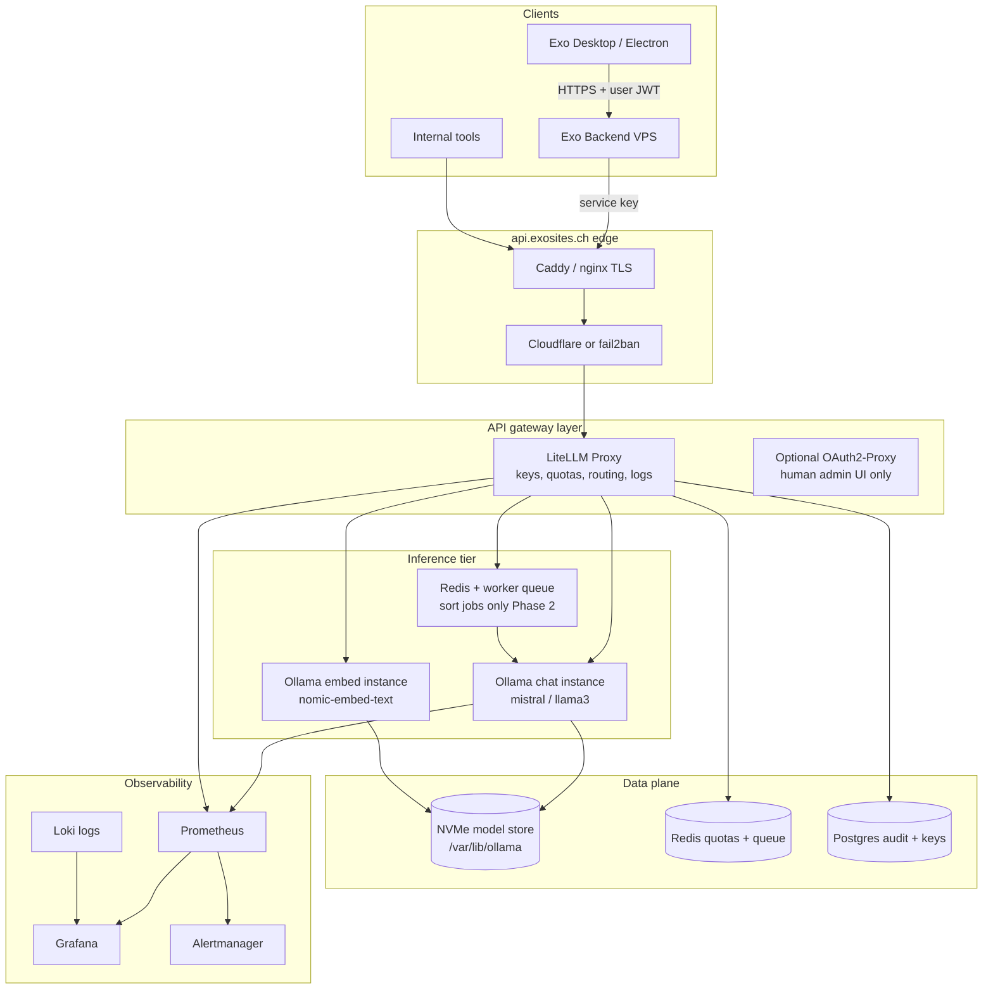

# Centralized Ollama / LLM Inference — Production Architecture

**Status:** Architecture complete (June 2026)  
**Audience:** Platform / backend team moving Exo from per-desktop `ollama serve` to `api.exosites.ch` (or dedicated `llm.exosites.ch`).

**Execution:** [`OLLAMA_IMPLEMENTATION_PLAN.md`](./OLLAMA_IMPLEMENTATION_PLAN.md) — 6-week phases, SLOs, ticket backlog, rollout.  
**Deploy scaffold:** [`infra/llm/`](../infra/llm/) — Compose, LiteLLM, Caddy, scripts, runbooks.

---

## Executive recommendation (opinionated)

| Phase | When | Stack |
|-------|------|--------|
| **Day 1** | First 10–30 active users | **1 GPU node**, Ollama in Docker, **Caddy** TLS, **LiteLLM** (or Envoy + custom) for API keys + rate limits, **Prometheus + Grafana** |
| **Phase 2** | Sort bursts, >15 concurrent inference slots | Add **Redis request queue** for batch/sort workloads; split **embed** vs **chat** instances |
| **Phase 3** | >30–50 sustained concurrent chat generations | Migrate **chat/classify** to **vLLM** (continuous batching); keep Ollama for dev/embeddings or retire it |

**Do not expose Ollama `:11434` to the internet.** It has no authentication, no per-tenant quotas, and no audit trail.

**Hard truth:** Ollama is excellent for local dev (matches Exo today: `electron/ollama.js`, `backend/classifier.py`). For **multi-user production concurrency**, design around its **FIFO queue + `OLLAMA_NUM_PARALLEL` VRAM multiplier**, not around “unlimited scale.” Plan a **vLLM escape hatch** early (OpenAI-compatible API → mostly config change).

---

## Reference architecture



**DNS:** `llm.exosites.ch` → GPU host (recommended subdomain). Avoid mixing with existing REST API on same process without path-based isolation.

---

## 1. Infrastructure & server requirements

### Workload profile (Exo-specific)

From this repo today:

| Workload | Model (default) | Pattern | Latency sensitivity |
|----------|-----------------|---------|---------------------|
| Document classify | `mistral` (~7B Q4) | 1–3× `ollama.chat` per file | Batch OK |
| Semantic rerank | `nomic-embed-text` | Embedding per query | Low |
| Optional vision | User-selected | Rare, image+text | Medium |
| Chat fallback | `OLLAMA_DEFAULT_MODEL` | Only when cloud keys absent | Medium |

Voice/agent uses **Gemini**, not Ollama — GPU planning is **sort + embeddings + optional local chat**, not voice.

### VRAM / RAM sizing (Q4_K_M, 4k context, flash attention on)

| Model class | Weight VRAM | Per parallel slot (4k ctx, approx.) | Notes |
|-------------|-------------|--------------------------------------|--------|
| 7–8B Q4 | ~5 GB | ~0.3–0.8 GB | Exo default (`mistral`) |
| 13B Q4 | ~8–10 GB | ~0.5–1.2 GB | Quality upgrade path |
| 70B Q4 | ~40–42 GB | ~2–4 GB+ | Needs A100 80GB or multi-GPU vLLM |
| nomic-embed | ~0.5 GB | Small | Keep on separate small instance |

**Rule of thumb:**

```
VRAM_needed ≈ model_weights × 1.1 + (OLLAMA_NUM_PARALLEL × kv_per_slot) + 1.5 GB overhead
```

Enable: `OLLAMA_FLASH_ATTENTION=1`, consider `OLLAMA_KV_CACHE_TYPE=q8_0` to shrink KV cache.

### Tier table (concurrent **inference slots**, not “logged-in users”)

| Tier | Concurrent slots | Primary model | Minimum GPU | Recommended GPU | System RAM |
|------|------------------|---------------|-------------|-----------------|------------|
| **Dev/staging** | 2 | 7B Q4 | — | CPU only (slow) | 32 GB |
| **Prod S** | 4 | 7B Q4 + embed | 16 GB (L4/T4) | 24 GB (L4/4090) | 32 GB |
| **Prod M** | 8 | 7B Q4 + embed | 24 GB | 24–48 GB (A10/L40S) | 64 GB |
| **Prod L** | 16+ | 13B or 70B | 48 GB+ | A100 40/80 GB | 128 GB+ |

**Mapping “users” → slots (Exo):**

- Light assistant use: ~0.05–0.1 slots/user average.
- Active sort session: 1 slot per `EXOSITES_SORT_MAX_CONCURRENCY` (default 1, max 8) **per user** running a job.
- **10 users sorting at once** with concurrency 1 → **10 slots** → exceeds single 24GB 7B node with `NUM_PARALLEL=4`; need queue or second instance.

### OS / kernel

- **OS:** Ubuntu 22.04/24.04 LTS (NVIDIA driver + container toolkit).
- **FS:** XFS or ext4 on **local NVMe** for `/var/lib/ollama/models` (not NFS for active inference).
- **Kernel:** default is fine; ensure `vm.swappiness=10` (avoid GPU page-out thrash).
- **ulimits:** `LimitNOFILE=1048576` for gateway + Ollama systemd/container.
- **CPU:** 8+ physical cores for preprocessing; GPU does matmul.

### Reverse proxy (Caddy recommended for TLS + simplicity)

```caddy
llm.exosites.ch {
    encode gzip
    reverse_proxy litellm:4000 {
        flush_interval -1          # streaming SSE
        transport http {
            read_timeout 600s
            write_timeout 600s
        }
    }
    header {
        Strict-Transport-Security "max-age=31536000; includeSubDomains"
        -Server
    }
}
```

- **TLS:** ACME (Let’s Encrypt) or Cloudflare proxied mode.
- **Never** proxy directly to Ollama without auth layer.
- **Streaming:** disable buffering (`proxy_buffering off` in nginx; `flush_interval -1` in Caddy).

### Firewall / SSH / DDoS

| Rule | Purpose |
|------|---------|
| Allow 443/tcp public | HTTPS only to Caddy |
| Deny 11434 public | Ollama localhost/docker network only |
| Allow 22/tcp from bastion IP | SSH jump host |
| Internal 9090/3000 | Prometheus/Grafana VPN-only |

- **SSH:** keys only, `PermitRootLogin no`, `fail2ban` on ssh + Caddy 401/429 storms.
- **DDoS:** Cloudflare in front of `llm.exosites.ch`; rate limit at gateway (LiteLLM) and edge.
- **Egress:** restrict Ollama from pulling models except via controlled `ollama pull` job (optional allowlist).

---

## 2. Multi-user resource allocation

### How Ollama schedules work

| Knob | Default | Meaning |
|------|---------|---------|
| `OLLAMA_NUM_PARALLEL` | 1 | Max concurrent sequences **per loaded model** |
| `OLLAMA_MAX_LOADED_MODELS` | 1 (GPU) | Distinct models resident in VRAM |
| `OLLAMA_MAX_QUEUE` | 512 | FIFO queue; overflow → **HTTP 503** |
| `OLLAMA_KEEP_ALIVE` | 5m | Idle unload; set 15–30m for prod hot models |

**Cannot load two copies of the same model** on one instance for horizontal sharding within a node — scale **instances**, not duplicates.

### Isolation strategies

1. **Gateway quotas (day 1):** per API key RPM + token budget (LiteLLM built-in).
2. **Separate instances (phase 2):** `embed` vs `chat` so embedding storms don’t evict chat model.
3. **Queue tier (phase 2):** sort/classify jobs → Redis queue → fixed worker pool (fair scheduling).
4. **Priority classes:** interactive chat `priority=high`, batch sort `priority=low` (gateway or queue).
5. **No hard multi-tenant VRAM isolation in Ollama** — one heavy 32k-context user eats parallel slots; cap `num_ctx` at gateway.

### Capacity estimates (7B Q4, 24GB GPU, flash attn)

| NUM_PARALLEL | Steady chat tok/s (aggregate) | p95 latency @ 5 concurrent | p95 @ 15 concurrent |
|--------------|-------------------------------|----------------------------|---------------------|
| 2 | ~80–120 | ~2–4 s | ~8–15 s |
| 4 | ~100–160 | ~3–6 s | ~15–45 s (queue) |

Treat >70% sustained GPU memory as **no headroom** — alert and stop raising parallel.

---

## 3. Container architecture

### Docker Compose vs Kubernetes

| Factor | Compose (day 1) | Kubernetes (phase 3) |
|--------|-----------------|----------------------|
| Team size < 5 | ✅ Fast, readable | Overkill |
| 1–3 GPU nodes | ✅ | Optional |
| GPU autoscale | Manual | ✅ Cluster autoscaler + GPU operator |
| Model PV | Bind mount / named volume | PVC + node-local SSD |

**Recommendation:** **Compose on single GPU VPS** for day 1–2; **K8s** when you run **≥3 GPU nodes** or need automated failover.

### Compose service layout (reference)

```yaml
services:
  ollama-chat:
    image: ollama/ollama:latest
    volumes:
      - ollama_models:/root/.ollama
    environment:
      OLLAMA_HOST: 0.0.0.0:11434
      OLLAMA_NUM_PARALLEL: 4
      OLLAMA_MAX_LOADED_MODELS: 1
      OLLAMA_MAX_QUEUE: 64
      OLLAMA_KEEP_ALIVE: 30m
      OLLAMA_FLASH_ATTENTION: 1
    deploy:
      resources:
        reservations:
          devices:
            - capabilities: [gpu]
    healthcheck:
      test: ["CMD", "curl", "-f", "http://localhost:11434/api/tags"]
      interval: 30s
      timeout: 10s
      retries: 3
    restart: unless-stopped

  ollama-embed:
    image: ollama/ollama:latest
    volumes:
      - ollama_models:/root/.ollama
    environment:
      OLLAMA_NUM_PARALLEL: 8
      OLLAMA_MAX_LOADED_MODELS: 1
    # CPU-only acceptable for nomic-embed-text
    restart: unless-stopped

  litellm:
    image: ghcr.io/berriai/litellm:main-latest
    volumes:
      - ./litellm_config.yaml:/app/config.yaml
    command: ["--config", "/app/config.yaml"]
    depends_on:
      ollama-chat:
        condition: service_healthy
    restart: unless-stopped

  caddy:
    image: caddy:2
    ports:
      - "443:443"
    volumes:
      - ./Caddyfile:/etc/caddy/Caddyfile
      - caddy_data:/data
    restart: unless-stopped

volumes:
  ollama_models:
    driver: local
    driver_opts:
      type: none
      oem: bind
      device: /mnt/nvme/ollama
```

### Model storage

- **Size:** 4–8 GB per 7B Q4; 40+ GB per 70B; plan **200–500 GB NVMe** for catalog + upgrades.
- **Shared volume** across chat/embed containers on same host (read-only mount for embed optional).
- **Warm models:** pull via CI job; don’t rely on first-request pull in prod.
- **Updates:** `ollama pull` new tag → health check → switch LiteLLM routing → drain old (see §8).

### Health / shutdown

- **Readiness:** `GET /api/tags` includes required model names.
- **Graceful deploy:** `SIGTERM` → stop gateway new requests → wait `keep_alive` drain or max 120s → replace container.
- **Liveness:** GPU OOM or hang → restart policy `unless-stopped` + alert.

---

## 4. Scalability

### Horizontal scaling

```
                    ┌─────────────┐
   Clients ────────►│ LiteLLM /   │
                    │  Router     │
                    └──────┬──────┘
           ┌───────────────┼───────────────┐
           ▼               ▼               ▼
      Ollama-1        Ollama-2        Ollama-3
      (mistral hot)   (mistral hot)   (llama3 hot)
```

- **Load balancer:** LiteLLM router or HAProxy with consistent hash on `model` header.
- **Sticky routing not required** if each instance loads same default model.

### Model routing

| Request model | Route to |
|---------------|----------|
| `mistral` | `ollama-chat-{1..N}` where model pre-loaded |
| `nomic-embed-text` | `ollama-embed` CPU pool |
| `llama3:70b` | Dedicated 80GB node only |

LiteLLM `model_list` + `router_settings` map logical names → backend URLs.

### Autoscale triggers

| Signal | Action |
|--------|--------|
| Queue depth > 20 for 5m | Scale workers (queue) or add GPU instance |
| GPU util > 85% 10m | Add instance (manual day 1; autoscaler phase 3) |
| p95 latency > SLO | Raise capacity, not `NUM_PARALLEL` blindly |
| 503 rate > 1% | Increase instances or lower per-key RPM |

### Cold start mitigation

- `OLLAMA_KEEP_ALIVE=30m` on prod.
- **Cron:** `POST /api/generate` noop or `ollama run` warmup every 10m for hot models.
- **Preload on deploy:** init container runs `ollama pull mistral` before marking ready.

---

## 5. Access control & multi-tenancy

### API keys (day 1)

| Principal | Key type | Scope |
|-----------|----------|--------|
| Exo desktop (per user) | User key via Exo backend | `mistral`, embed; RPM capped |
| Exo backend service | Service key | Higher RPM, sort queue |
| CI / eval | Rotating key | Staging models only |

- **Rotation:** 90-day TTL; support dual-key overlap.
- **Storage:** LiteLLM Postgres or Vault; never in desktop bundle.

### Rate limits (starting points)

| Class | req/min | tokens/day | burst |
|-------|---------|------------|-------|
| Free user | 20 | 500k | 5 |
| Pro user | 60 | 2M | 15 |
| Service (sort) | 300 | unlimited | 50 |

Return **429** with `Retry-After`; clients (Exo) should backoff on 503/429.

### Team / model ACL

LiteLLM `model_access` groups:

- `team:exo-sort` → `mistral`, `nomic-embed-text`
- `team:exo-admin` → `*` + pull disabled at gateway
- Block **70B** for default tier — cost guardrail.

### Audit log (required fields)

```json
{
  "ts": "ISO8601",
  "key_id": "hash",
  "user_id": "exo-uuid",
  "model": "mistral",
  "endpoint": "chat",
  "prompt_tokens": 1200,
  "completion_tokens": 42,
  "latency_ms": 1840,
  "status": 200,
  "client": "exo-desktop/1.0.0"
}
```

Retain 90 days (GDPR: no prompt body in logs unless debug tier opt-in).

---

## 6. Observability & ops

### Logging

- **Structured JSON** from LiteLLM + Caddy access logs → **Loki** or Cloud provider log sink.
- **Ollama:** scrape journald/docker logs; grep OOM separately.

### Metrics (Prometheus)

| Metric | Source | Alert |
|--------|--------|-------|
| `gpu_memory_used_bytes` | DCGM exporter | >90% 5m |
| `ollama_queue_depth` | custom exporter / logs | >30 |
| `litellm_request_duration_seconds` | LiteLLM | p95 > 30s |
| `litellm_429_total` / `503_total` | LiteLLM | >1% error rate |
| `model_loaded` | `/api/ps` poll | unexpected unload |

**Grafana dashboards:** GPU util, tok/s estimate, latency by model, top API keys, 503 heatmap.

### Tracing

OpenTelemetry from **Exo backend** → gateway → Ollama (W3C traceparent on `X-Request-ID`). Ollama won’t propagate spans — gateway span is enough for SLO.

### Runbooks (minimum)

1. **503 storm** — check GPU OOM, queue depth, scale instance, lower `NUM_PARALLEL`.
2. **Model missing** — run preload job, verify volume mount.
3. **Latency regression** — check new model quant, context length abuse, thermal throttle.
4. **Key compromise** — revoke in LiteLLM, rotate, audit last 24h.

---

## 7. Cost & capacity planning

### Quantization trade-off (7–8B on 24GB)

| Quant | VRAM | tok/s (indicative) | Quality |
|-------|------|-------------------|---------|
| Q4_K_M | ~5 GB | ~55–60 | Default sweet spot |
| Q5_K_M | ~6 GB | ~45 | Slight gain |
| Q8_0 | ~10 GB | ~35–40 | Diminishing returns |
| F16 | ~16 GB | — | Wastes VRAM for infer |

### Concurrency before degradation (7B Q4, 24GB)

| Parallel slots | OK for | Degrades when |
|----------------|--------|---------------|
| 4 | ≤4 simultaneous generations | 5+ wait in queue |
| 8 | Needs 48GB+ or smaller ctx | OOM or 40s+ p95 |

### Cloud vs bare metal (GPU)

| | Bare metal (Hetzner/OVH) | Cloud (AWS/GCP) |
|--|--------------------------|-----------------|
| **Cost** | €300–900/mo for mid GPU | $800–2,500/mo per L4/A10 |
| **Ops** | You manage firmware | Easier attach/detach |
| **Egress** | Often generous | Expensive |
| **Verdict** | **Best $/GPU-hour** for steady load | Burst / multi-region |

### Cost curve (rough monthly, EU, inference only)

| Active users | Slots peak | Infra | Est. cost |
|--------------|------------|-------|-----------|
| 10 | 4 | 1× 24GB GPU VPS | €350–500 |
| 50 | 15 | 2× 24GB or 1× A100 40G + queue | €900–1,800 |
| 100 | 30 | 3× GPU + LiteLLM HA + Redis | €2,500–4,000 |
| 500 | 100+ | K8s GPU pool + vLLM | €8k–15k+ |

*Assumes most inference is sort-batch, not 500 simultaneous voice-like chats.*

---

## 8. CI/CD & maintainability

### Model deployment pipeline

```
PR merge → staging pull → smoke eval (classify_eval) → manual approve → prod pull → warmup → flip router weight
```

- **Manifest:** `models.yaml` pins `mistral@sha256-digest` equivalents (Ollama tag + internal version).
- **Zero-downtime:** add `mistral-2026-06-18` route at 10% → 100% over 1h.
- **Rollback:** revert LiteLLM route to previous tag; `keep_alive` clears bad model.

### Config & secrets

| Item | Where |
|------|--------|
| `OLLAMA_*` env | Compose / K8s ConfigMap |
| API master keys | Vault / SOPS |
| Per-user keys | Postgres via Exo account service |
| `litellm_config.yaml` | Git reviewable (no secrets) |

### Exo client changes (this repo)

| Location | Change |
|----------|--------|
| `backend/llm/ollama_client.py` | **New** — single client; OpenAI-compatible when remote |
| `electron/ollama.js` | Disable auto `ollama serve` when `OLLAMA_MODE=remote` |
| `backend/classifier.py` | Use `ollama_client.chat` |
| `backend/semantic_rerank.py` | Use `ollama_client.embed` |
| `backend/health_checks.py` | Remote-aware readiness |
| Settings UI | Local vs cloud toggle; test connection via `/ready` |

### Client contract (remote mode)

| Concern | Behavior |
|---------|----------|
| **Auth** | Backend holds LiteLLM virtual key; desktop never sends prod key |
| **Endpoint** | `OLLAMA_HOST=https://llm.exosites.ch` → LiteLLM `/v1/*` |
| **Retry** | 429/503: exponential backoff, max 3, honor `Retry-After` |
| **Timeout** | `OLLAMA_REQUEST_TIMEOUT_S=120` classify; 60s embed |
| **Admission** | `EXOSITES_LLM_MAX_SLOTS` caps concurrent server-side sort LLM calls |
| **Fallback** | No silent local fallback in prod — fail with actionable error |
| **Observability** | `X-Request-ID` on every call; log tokens + latency, not prompt body |

### Documentation standards

- One **runbook per alert**.
- **SLO doc:** p95 < 10s classify @ 4k ctx for 7B (batch), 99.5% availability.
- **Architecture decision record** when moving chat to vLLM.

---

## Ollama hard limits (design around these)

| Limit | Implication |
|-------|-------------|
| No built-in auth | Mandatory API gateway |
| No continuous batching | Latency cliffs under concurrent load; vLLM for scale |
| One copy of model per instance | Scale out instances, not duplicates |
| `NUM_PARALLEL` × KV VRAM | Raising parallel without VRAM → OOM or 503 |
| FIFO queue | Head-of-line blocking; use fair queue for batch |
| No multi-GPU tensor parallel | 70B needs big single GPU or vLLM |
| Pull at runtime risky | Pre-pull in deploy pipeline |
| Streaming through naive proxies breaks | Disable proxy buffering |

---

## Day 1 vs defer

| Day 1 (must) | Defer |
|--------------|-------|
| GPU VPS + Compose | Kubernetes |
| Caddy TLS + LiteLLM keys/limits | Custom auth service |
| Single chat GPU instance + embed CPU | Multi-region |
| Prometheus + Grafana basic | Full ELK |
| Model preload + health checks | Autoscaler |
| Exo remote `OLLAMA_HOST` | Per-user keys in desktop (proxy via backend first) |
| Audit logs at gateway | Full prompt logging |
| Runbook 503/OOM | vLLM migration |

**First production milestone:** Exo backend proxies all Ollama calls; desktop never touches `:11434` directly.

---

## Suggested hostnames on exosites.ch

| Host | Purpose |
|------|---------|
| `llm.exosites.ch` | Public inference API (LiteLLM) |
| `llm-admin.exosites.ch` | Grafana / OAuth admin (VPN) |
| `api.exosites.ch` | Existing Exo API (orchestrates user keys → llm) |

---

## Related reading

- [`OLLAMA_IMPLEMENTATION_PLAN.md`](./OLLAMA_IMPLEMENTATION_PLAN.md) — phases, SLOs, security, DR, tickets
- [`infra/llm/README.md`](../infra/llm/README.md) — deploy commands and layout
- [Ollama issue #358 — parallel requests](https://github.com/ollama/ollama/issues/358)
- [LiteLLM proxy — rate limits & keys](https://docs.litellm.ai/docs/proxy/virtual_keys)
- Exo: `backend/constants.py` (`DEFAULT_OLLAMA_MODEL`), `EXOSITES_SORT_MAX_CONCURRENCY`
