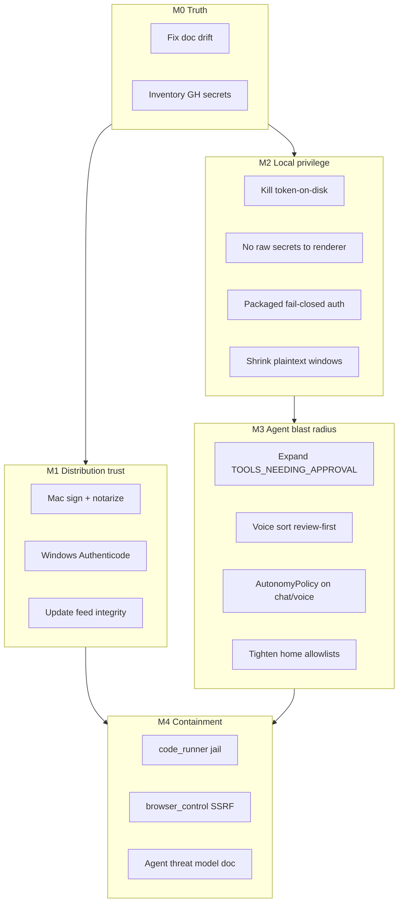
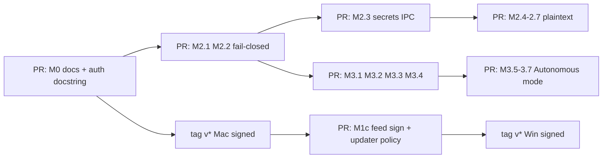

# Exo security hardening plan

**Status:** M2 / M3 / M4 implemented in-tree (2026-07-15). **M1b** (Windows Authenticode) still open (ops/cert). **§8 legal** — verify separately (`npm run verify:legal-urls` + live privacy LI copy).  
**Date:** 2026-07-15 · **Amended:** 2026-07-15 (execution appendix + status)  
**Scope:** Close gaps from the honest security assessment + deep audit of signing/updater, local API/secrets, and agent/sorter blast radius.  
**Repo:** `assistant-ai` (mirror critical path changes to `ai-file-sorter` only if still shipping from it)  
**Companion:** This document is the single source of truth for the hardening epic.

**Threat model (unchanged, honest):** Protect against untrusted path strings, remote peers, supply-chain tampering, prompt injection into agent tools, and casual same-machine abuse. **Not** defending against malware already running as the OS user with full process/env access.

---

## Audit findings (summary)

| Area | Reality today | Severity |
|------|---------------|----------|
| Mac signing | CI path exists; secrets optional → **unsigned ships** | P0 distribution |
| Windows signing | Documented; **not wired** (manual packager + Inno) | P0 distribution |
| Auto-update | Mac: `latest-mac.yml` + sha512; discovery via **Ed25519-signed** `latest.json` (M1c); Win: no self-update | mitigated (Win Authenticode still open) |
| Local API | Loopback + `X-App-Token`; auth **off** if token unset or `EXOSITES_INSECURE_LOCAL` | P0 if misconfigured |
| Secrets | `safeStorage` good; residual **gmail_oauth.json**, `.env`, legacy `*.b64`, XSS→`getSecret` | P0–P1 |
| Paths | Denylist OS roots; **entire `$HOME` still allowed** for many ops | P1 |
| Agent tools | Only 3 tools need approval; `control_computer` / `file_workspace` / voice auto-sort do not | P0 product |

---

## Milestone 0 — Truth & hygiene (1–2 days)

**Goal:** Stop lying to ourselves in docs/ops.

| ID | Work | Paths |
|----|------|-------|
| M0.1 | Align `DISTRIBUTION.md` / `MACOS.md` with `electron/autoUpdater.js` (exosites.ch feed, not GitHub) | `docs/DISTRIBUTION.md`, `docs/MACOS.md` |
| M0.2 | Inventory which `MAC_CSC_*` / `WIN_CSC_*` / `APPLE_*` secrets exist on `Chadoud/assistant-ai` | GitHub secrets |
| M0.3 | Document: Windows Authenticode is **not** CI-ready until SignTool is wired | `docs/DISTRIBUTION.md` |
| M0.4 | Fix middleware docstring vs `app_token_auth_enabled()` (missing token = auth off) | `backend/main.py`, `backend/app_auth.py`, `docs/SECURITY.md` |

**Done when:** Docs match runtime; secret inventory written in runbook.

---

## Milestone 1 — Distribution trust (highest user-facing gap)

### M1a — Mac signed + notarized (1–2 weeks wall-clock)

| ID | Work | Paths |
|----|------|-------|
| M1a.1 | Populate Apple secrets: `MAC_CSC_LINK`, `MAC_CSC_KEY_PASSWORD`, `MAC_SIGN_IDENTITY`, `APPLE_ID`, `APPLE_APP_SPECIFIC_PASSWORD`, `APPLE_TEAM_ID` | GitHub Actions |
| M1a.2 | Ensure backend PyInstaller binary is signed when Electron is (both required) | `.github/workflows/build.yml`, `scripts/build-mac-release.sh` |
| M1a.3 | Tag release: notarize + staple; Gatekeeper clean install smoke | `scripts/notarize.cjs` |
| M1a.4 | **Fail tag builds** if signing/notarization skipped when secrets present | `build.yml` + new verify script |
| M1a.5 | Confirm in-app Mac update from `latest-mac.yml` on signed build | `electron/autoUpdater.js` |

### M1b — Windows Authenticode (1–2 weeks + cert lead time)

| ID | Work | Paths | Status |
|----|------|-------|--------|
| M1b.1 | Obtain OV/EV Authenticode cert; store `WIN_CSC_*` | Ops | **Open** (ops/cert) |
| M1b.2 | Sign `Exo.exe` after pack + `Exo Setup.exe` after Inno | `scripts/package-app.js`, `installer.iss`, `build.yml` | **Open** |
| M1b.3 | Stop claiming Win secrets “auto-apply” until this lands | docs | **Open** (docs already warn unsigned) |

### M1c — Update-channel integrity (≈1 week) — **implemented 2026-07-15**

| ID | Work | Paths | Status |
|----|------|-------|--------|
| M1c.1 | Authenticate `latest.json` (dedicated Ed25519; license pattern reused) | `electron/updateFeed/*`, `tools/update-feed-keygen/`, publish scripts | **Done** |
| M1c.2 | Packaged clients reject bad/missing feed `sig`; Mac self-update only if Developer ID–signed | `electron/autoUpdater.js` | **Done** |
| M1c.3 | CI deploy prefers `EXOSITES_DEPLOY_SSH_PRIVATE_KEY`; password/`sshpass` fallback until key installed | `build.yml` `publish-website`, local publish script | **Done** (key-only; password fallback removed) |
| M1c.4 | Win self-update deferred; redirect to download page | `autoUpdater.js` | **Done** (unchanged policy) |

**Done when:** Public `v*` Mac is notarized; Win signed; feed not spoofable by mere HTTPS file replace without key; README can drop “unsigned” warning for signed platforms.  
**Remaining for “done when”:** Win Authenticode (M1b). Ops: delete unused `EXOSITES_DEPLOY_SSH_PASSWORD` GitHub secret + optional Infomaniak password rotate.

---

## Milestone 2 — Local API privilege & secrets (P0–P1 engineering)

### P0

| ID | Work | Paths | Status |
|----|------|-------|--------|
| M2.1 | Never persist app token to disk in normal flows; remove/gate `.dev-app-token` | `electron/backendProcess.js` | **Done** |
| M2.2 | Packaged builds: refuse `EXOSITES_INSECURE_LOCAL`; fail closed if token unset | `electron/backendProcess.js`, `backend/app_auth.py` | **Done** |
| M2.3 | Stop returning raw secret values / app token to renderer; masked status only; main relays to backend | `electron/ipc/secretsHandlers.js`, `electron/preload.js`, `frontend` hydrate | **Done** |
| M2.4 | Shrink/eliminate plaintext `gmail_oauth.json` materialization window; guaranteed wipe on crash | `electron/gmailOAuthMirrorStore.js` | **Done** |

### P1

| ID | Work | Paths | Status |
|----|------|-------|--------|
| M2.5 | Remove voice `?token=` fallback; header + first-frame `app_auth` only | `backend/voice_ws_auth.py`, ADR-005, tests | **Done** |
| M2.6 | Cloud session: fail-closed (no plaintext write) when `safeStorage` unavailable | `electron/cloudAuth.js` | **Done** |
| M2.7 | Drop legacy `plain: true` / `*.b64` readers; wipe leftovers | `electron/integrations/storage.js`, notion/infomaniak stores, `localDataWipe.js` | **Done** |
| M2.8 | Path allowlists: remove blanket `$HOME` from `authorizedPaths`; block `userData` / secrets dirs in `output_dir_guard`; resolve+stay-under-root for destinations | `electron/authorizedPaths.js`, `backend/output_dir_guard.py`, `destination_path.py` | **Done** |

### P2

| ID | Work | Paths | Status |
|----|------|-------|--------|
| M2.9 | Drop CORS `"null"` if unused; no prod `CORS_EXTRA_ORIGINS` | `backend/main.py` | **Done** |
| M2.10 | Rate-limit unauthenticated WS accepts | `voice_routes.py` | **Done** |

**Done when:** XSS cannot `getSecret`/`getBackendToken` full values; packaged backend always token-gated; no durable plaintext OAuth on disk; path grants are intentional.

---

## Milestone 3 — Agent / sorter blast radius (product + security)

**Product tradeoff (explicit):** Voice/chat autonomy will feel less “magical.” Prefer **one confirm** over silent desktop RPA.

### P0

| ID | Work | Paths | Status |
|----|------|-------|--------|
| M3.1 | Expand `TOOLS_NEEDING_APPROVAL`: at least `control_computer`, `os_control`, `file_workspace`, `start_local_file_sort`, `plan_and_execute`, mutating `browser_control`, `open_app`/`close_app`, write-y connectors | `backend/tool_registry/handlers.py`, `voice/tool_dispatch.py` | **Done** |
| M3.2 | Voice sort default `auto_apply=False` (Sort tab can stay auto-apply) | `backend/.../start_local_sort.py` | **Done** |
| M3.3 | SSRF-align `browser_control.go_to` with `safe_web_url` | `actions/browser_control.py` | **Done** |
| M3.4 | Narrow `terminal_safe` (`cat` / free `npm run`) | `system_safe.py`, tests | **Done** |

### P1

| ID | Work | Paths | Status |
|----|------|-------|--------|
| M3.5 | Apply `AutonomyPolicy` in chat + voice; default `allow_sensitive=False` unless Settings “Autonomous mode” | `llm/chat_loop.py`, `voice/tool_dispatch.py`, settings | **Done** |
| M3.6 | Single source of truth for SAFE / SENSITIVE / APPROVAL / BLOCKED | `handlers.py`, `orchestrator/policy.py`, `risk_tiers.py` | **Done** |
| M3.7 | `plan_and_execute`: one-shot “allow mutations for this goal” before sensitive steps | `agent_task.py`, `orchestrator_runner.py` | **Done** |

### P2

| ID | Work | Paths | Status |
|----|------|-------|--------|
| M3.8 | Sandbox or hard-document `code_runner` (network off / cwd jail) | `actions/code_runner.py` | **Done** (documented residual; no OS network jail) |
| M3.9 | `file_workspace` / `open_app`: workspace roots + curated app keys | file_workspace, `knownApplications.js` | **Done** |
| M3.10 | Uncertain sort rows default `approved=False` before apply | `job_service/_impl.py` | **Done** |

**Done when:** Prompt injection cannot silently drive GUI control / home-wide file moves / voice auto-sort without a confirm; Sort-tab UX unchanged.

---

## Milestone 4 — Docs, tests, gates

| ID | Work | Paths | Status |
|----|------|-------|--------|
| M4.1 | Add `docs/AGENT_TOOL_THREAT_MODEL.md` (capability matrix) | new | **Done** |
| M4.2 | Update root `SECURITY.md` + `docs/SECURITY.md` (remove localStorage key myth; document residual same-user risk) | | **Done** |
| M4.3 | CI: security regression tests for approval set, voice auth (no query token), packaged auth fail-closed, path guards | `backend/tests/test_security_hardening_gates.py` (+ existing voice/path/approval tests); CI already runs `pytest` | **Done** |
| M4.4 | `npm run verify:legal-urls` style: optional `verify:security-posture` checklist script for release | `scripts/verify-security-posture.mjs` | **Done** |
| M4.5 | After M1: README download note = signed platforms only | `README.md` — Mac signed/notarized; Win unsigned until M1b | **Done** (partial: Mac only) |

---

## Priority order (if capacity is limited)

1. **M1a** Mac sign/notarize — stops training users to bypass Gatekeeper  
2. **M2.2 + M2.3** Packaged auth fail-closed + no secrets in renderer — XSS blast radius  
3. **M3.1 + M3.2** Approval expansion + voice review-first — prompt-injection RPA  
4. **M1c** Feed integrity — supply chain  
5. **M1b** Windows signing — SmartScreen  
6. Rest of M2/M3/M4  

---

## Out of scope (explicit)

- Defending against malware already running as the same OS user with full ptrace/env access  
- Multi-tenant server isolation (this is not that product)  
- Rewriting the Sort-tab one-click apply UX (keep; harden voice/agent instead)  
- Full browser sandbox for Electron (Chromium already; don’t pretend OS sandbox)

---

## Success criteria

| Criterion | Metric |
|-----------|--------|
| Distribution | Clean Mac install without right-click override; Win without SmartScreen “unknown publisher” (after reputation) |
| Update | Compromising web root alone cannot ship an update accepted by signed clients |
| Local API | Packaged app never starts with auth disabled; renderer never holds raw API keys |
| Agent | Critical tools require explicit approval; voice sort is review-first by default |
| Honesty | Docs match code; residual same-user risk stated in `SECURITY.md` |

---

## Suggested ownership

| Track | Owner type |
|-------|------------|
| Apple/Win certs + CI secrets | You / ops |
| M1 CI + updater | Electron/packaging |
| M2 secrets/API | Electron + backend |
| M3 tools/policy | Backend agent + product call on Autonomous mode default |
| M4 docs/tests | Whoever lands the code |

**Estimated calendar (serial):** M0 2d → M1a 1–2w → M2 P0 1w → M3 P0 1–1.5w → M1b/M1c parallel → M4 continuous.  
**Realistic “solid enough for public high-trust”:** after **M1a + M2 P0 + M3 P0**.

---

# Execution appendix

## 1. Go / no-go decisions (lock before coding)

Record answers in this table (date + initials). Defaults below are the **recommended** senior defaults if you want to move without debate.

| ID | Decision | Options | **Default (recommended)** | Locked? |
|----|----------|---------|---------------------------|---------|
| **D1** | Buy / renew Apple Developer Program + export Developer ID Application `.p12` now? | Now / Defer | **Now** — blocks M1a | **Accepted 2026-07-15** (ops pending) |
| **D2** | Windows Authenticode: OV vs EV? | OV (cheaper, SmartScreen reputation delay) / EV (USB/token, faster trust) / Defer Win | **OV now**, EV later if public launch scales | **Accepted 2026-07-15** |
| **D3** | `latest.json` trust | **A)** Ed25519-sign payload (reuse license keygen pattern) / **B)** Mac discovery from `latest-mac.yml` only; `latest.json` notes-only / **C)** Leave unsigned (reject) | **A** for notes+version; Mac install still via signed app + yml sha512 | **Accepted 2026-07-15** |
| **D4** | After first signed Mac ship, refuse unsigned updates? | Yes / Soft-warn only | **Yes** (`forceCodeSignatureVerification` or equivalent) | **Accepted 2026-07-15** |
| **D5** | Settings “Autonomous mode” default | Off (approve sensitive) / On (current feel) | **Off** | **Accepted 2026-07-15** |
| **D6** | Voice sort default | Review-first (`auto_apply=False`) / Keep auto-apply | **Review-first** | **Accepted 2026-07-15** (shipped in code) |
| **D7** | Sort-tab one-click apply | Keep / Also require review | **Keep** (product core) | **Accepted 2026-07-15** |
| **D8** | Deploy to Infomaniak | SSH key + disable password for CI / Keep sshpass | **SSH key** before M1c | **Accepted 2026-07-15** (ops pending) |
| **D9** | Mobile store hardening in this epic? | In / Out | **Out** (see §7) | **Accepted 2026-07-15** |
| **D10** | Privacy LI supplement on live site? | Verify + merge if missing / Skip | **Verify first** (see §8) | **Accepted 2026-07-15** |
| **D11** | Twin `ai-file-sorter` | Mirror every PR / Public repo only | **Public (`assistant-ai`) only** unless private still ships installers | **Accepted 2026-07-15** |

**No-go:** Do not tag a “signed” marketing release until D1 is Yes and M1a.4 CI gate is green.

---

## 2. Acceptance tests (per work ID)

### M0

| ID | Pass criteria |
|----|---------------|
| M0.1 | `grep -n 'GitHub Releases feed\\|provider.*github' docs/DISTRIBUTION.md` shows corrected text; docs describe `exosites.ch/downloads/exo-assistant` |
| M0.2 | Runbook row: secret name → present/absent (no secret values committed) |
| M0.3 | `DISTRIBUTION.md` states Win signing “not wired until M1b” |
| M0.4 | Unit/doc: packaged + missing token → 401; `EXOSITES_INSECURE_LOCAL` documented as break-glass only |

### M1a (Mac)

| ID | Pass criteria |
|----|---------------|
| M1a.1 | `gh secret list -R Chadoud/assistant-ai` shows all six Apple-related names |
| M1a.2–3 | On clean Mac: open DMG → drag to Applications → double-click launches **without** right-click Open; `spctl --assess --type execute /Applications/Exo.app` → accepted; `stapler validate` on DMG/app OK |
| M1a.4 | Tag build with secrets present but notarize skipped → **job fails** |
| M1a.5 | Install vN → publish vN+1 signed → in-app update downloads → relaunch → version bump; unsigned zip rejected after D4 |

### M1b (Windows)

| ID | Pass criteria |
|----|---------------|
| M1b.2 | `signtool verify /pa "Exo Setup.exe"` and `Exo.exe` succeed; SmartScreen may still warn until reputation |

### M1c (Feed)

| ID | Pass criteria |
|----|---------------|
| M1c.1 | Tampered `latest.json` on a staging host → client rejects (bad/missing signature) **or** client ignores it for install path (D3-B) |
| M1c.2 | Signed client offered unsigned update → skip/fail closed |
| M1c.3 | CI prefers key auth (`EXOSITES_DEPLOY_SSH_PRIVATE_KEY`); password fallback until key installed |

### M2

| ID | Pass criteria |
|----|---------------|
| M2.1 | After quit, no `userData/.dev-app-token` in packaged; dev ephemeral or deleted on exit |
| M2.2 | Packaged + `EXOSITES_INSECURE_LOCAL=1` → refuse start or strip flag; curl without token → 401 on `/v1/*` |
| M2.3 | Renderer `electronAPI.getSecret` / `getBackendToken` absent or return masked/boolean only; e2e: settings still works |
| M2.4 | No durable `gmail_oauth.json` after backend exit; crash path wipe covered by test or atexit hook |
| M2.5 | `voice_ws_auth` rejects `?token=`; tests assert URL has no token |
| M2.6–2.7 | No plaintext session write; legacy readers gone; wipe list includes leftovers |
| M2.8 | Setting output dir to `~/Library/Application Support/.../settings_secrets_v1` → rejected |

### M3

| ID | Pass criteria |
|----|---------------|
| M3.1 | Dispatch without approval for `control_computer` / `file_workspace` / `start_local_file_sort` → denied; with `approval_granted` → OK |
| M3.2 | Voice sort job created with `auto_apply=False` unless explicit opt-in |
| M3.3 | `browser_control` `go_to` to `http://127.0.0.1` / metadata IP → rejected |
| M3.4 | `terminal_safe` rejects newly banned patterns; existing allowlist tests updated |
| M3.5 | Chat with Autonomous off cannot run SENSITIVE without approval UI |

### M4

| ID | Pass criteria |
|----|---------------|
| M4.3 | CI job runs new security tests on PR |
| M4.4 | `npm run verify:security-posture` exits 0 on main after M1a |
| M4.5 | README unsigned warning removed **only** for platforms that actually ship signed |

---

## 3. PR / release sequencing

| Step | Ship vehicle | Notes |
|------|--------------|-------|
| M0, M2, M3 code | PRs → `main` with normal CI; use `[skip ci]` **only** for docs-only | Do **not** `[skip ci]` auth/tooling PRs |
| M1a first signed build | Annotated tag `vX.Y.Z` → `Build Installers` | Marketing `latest.json` / DMG only after Gatekeeper smoke |
| M1c | PR before or with next tag after first signed | Old clients: keep accepting unsigned `latest.json` **until** min version gate, or dual-read (signed preferred) |
| M1b | Tag after SignTool wired + secrets present | May lag Mac by weeks (cert lead time) |
| README “signed” copy | Same PR as first successful signed platform publish | Partial: “macOS signed; Windows unsigned” OK |

**Client migration (updates):**

1. **Phase 0 (today):** unsigned clients, unsigned feed.  
2. **Phase 1:** signed Mac builds published; still accept old clients.  
3. **Phase 2 (D4):** new Mac builds require code signature on updates; optionally require signed `latest.json`.  
4. **Phase 3:** min-version nudge in notes for clients older than Phase 1.

---

## 4. Rollback

| Failure | Rollback |
|---------|----------|
| Notarization fails on tag | Do **not** publish DMG to `exo-assistant`; delete/leave GitHub release as draft; fix entitlements/backend sign; retag `vX.Y.Z-hotfix` or reuse tag only if never published |
| Signed build breaks launch | Restore previous `Exo.dmg` + `latest-mac.yml` + `latest.json` from last known-good rsync backup or GitHub release assets; bump feed version backward only if clients allow (prefer forward hotfix) |
| Feed signature rollout bricks updates | Publish `latest.json` with dual fields (`notes` unsigned + `sig` optional); clients treat missing sig as valid for one minor; or disable M1c.2 remotely via kill-switch env (document if added) |
| M2.3 breaks Settings / voice | Revert PR; keep M2.2 if safe; never ship renderer secret strip without e2e green |
| M3.1 too much friction | Feature-flag `TOOLS_NEEDING_APPROVAL` extras behind `autonomousMode` / `security.strictTools=true` default on for new installs |
| SSH key cutover locks CI | Keep password secret 48h as fallback; document break-glass |

**Rule:** Never rsync a half-failed Mac build over a working unsigned (or previous) DMG without a verified local open test.

---

## 5. Cost & calendar

| Item | Approx cost | Lead time | Blocks |
|------|-------------|-----------|--------|
| Apple Developer Program | ~USD 99/yr | 1–2 days (account) + cert export | M1a |
| Windows OV Authenticode | ~USD 200–400/yr (vendor-dependent) | Days–2 weeks | M1b |
| Windows EV | ~USD 300–600/yr + token | Weeks | Optional |
| Engineer time | — | M0: 1–2d; M2 P0: ~1w; M3 P0: ~1–1.5w; M1a calendar 1–2w; M1c ~1w | |
| Infomaniak SSH key | Free | Hours | M1c.3 |

**Parallel tracks (recommended):**

| Week | Track A (ops) | Track B (code) |
|------|---------------|----------------|
| 0 | D1–D11 lock; Apple account | M0 PR |
| 1 | Export `.p12`; add GH secrets | M2.1–M2.2 PR |
| 2 | Notarize dry-run tag | M2.3–M2.4 PR |
| 3 | First public signed Mac tag | M3.1–M3.2 PR |
| 4 | Order Win OV cert; SSH key | M1c + M3.3–M3.4 |
| 5+ | Win SignTool | M3.5+, M4 |

---

## 6. cloud-node / deploy (in epic, bounded)

Desktop-heavy epic; still close these server gaps so “solid” isn’t only the client.

| ID | Work | Priority | Acceptance |
|----|------|----------|------------|
| C1 | Confirm sort-credential broker + account API rate limits and auth on all non-public routes | P1 | Spot-check OpenAPI / middleware; no unauthenticated write |
| C2 | Crash/telemetry ingest: auth + size caps + scrub (already partially true) | P1 | Oversized/unauthenticated rejected |
| C3 | Rotate Infomaniak deploy password after SSH key cutover | P1 | Password unused by CI |
| C4 | `EXOSITES_DOWNLOADS_PATH` = `./sites/exosites.ch/downloads/exo-assistant` on both repos | P0 | Already set 2026-07-14 — re-verify in M0.2 |
| C5 | Backup last-known-good `latest.json` + DMG + yml before each publish | P2 | Script or manual checklist in `publish-website` |

**Out of this epic:** full cloud-node penetration test, WAF, multi-region HA.

---

## 7. Mobile (explicitly out)

| In | Out |
|----|-----|
| Shared legal URLs / `verify:legal-urls` | iOS/Android hardened store submission |
| GO SYNC crypto already in desktop threat model | Mobile crash opt-in redesign, cert pinning, Play/App Store privacy forms |

If a store submission starts, open a **separate** `docs/MOBILE_SECURITY_PLAN.md` — do not block desktop M1–M3 on it.

---

## 8. Legal / privacy verification (D10)

**Status:** Verify separately from code milestones (not auto-closed by M2–M4). Run before calling privacy “done.”

| Step | Action |
|------|--------|
| 1 | `npm run verify:legal-urls` from `assistant-ai` |
| 2 | Confirm live https://exosites.ch/eng/app-privacy mentions **legitimate interest** + Settings objection (Art. 21) |
| 3 | If missing: merge [`docs/legal/app-privacy-legitimate-interest-supplement.md`](legal/app-privacy-legitimate-interest-supplement.md) into `exosites-agency` `appPrivacy.ts` (EN+FR), deploy agency, re-verify |
| 4 | Bump `LEGAL_TERMS_BUNDLE_VERSION` only if user-facing legal text materially changes |

Not a code-signing blocker; **is** a trust/compliance blocker before calling privacy “done.”

---

## 9. Definition of Done (program)

Ship is “complete” when **all** of:

1. D1–D11 filled  
2. M0 done  
3. M1a green (notarized Mac on `exo-assistant`)  
4. M2 P0 done (M2.1–M2.4)  
5. M3 P0 done (M3.1–M3.4)  
6. M1c at least D3 default implemented  
7. §8 legal verify green  
8. `SECURITY.md` states residual same-user risk  
9. README unsigned warning accurate per platform  

**Stretch (not required for DoD):** M1b, M3 P1–P2, M4.4 script, code_runner sandbox.

---

## 10. Working agreement

- One milestone track per PR when possible; no drive-by refactors  
- Security PRs need tests from §2, not “looks fine”  
- Tag builds that publish installers: **no** `[skip ci]`  
- After each signed publish: 15-minute Gatekeeper/SmartScreen smoke before announcing  
