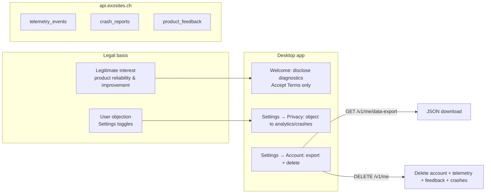

# GDPR compliance plan — legitimate interest + data rights

**Status:** Implemented (2026-06-25)  
**Created:** 2026-06-25  
**Legal basis (chosen):** Legitimate interest (Art. 6(1)(f) GDPR / Swiss FADP equivalent) for **coarse product diagnostics** and **crash reports** — not consent.  
**Owner:** Product + engineering; counsel sign-off required before claiming compliance.

**Related:** [`COUNSEL_REVIEW_PACKET.md`](../COUNSEL_REVIEW_PACKET.md), [`SECURITY.md`](../../SECURITY.md), [`DATASUITE_RETENTION.md`](../DATASUITE_RETENTION.md), [`runbooks/legal-publish.md`](../runbooks/legal-publish.md)

---

## Goal

Align product behavior, in-app copy, cloud erasure, and published legal text so that:

1. Diagnostics run on **legitimate interest** (disclosed, balanced, objection available).
2. Users can **download cloud-held data** from Settings → Account.
3. **Account deletion** removes linked **crash reports** (not only telemetry/feedback).
4. **Counsel signs off** EN/FR privacy/terms vs. implementation.
5. **Internal docs** match code (no “opt-in Settings toggle” fiction).

---

## Non-goals (this plan)

- Adding PII to telemetry (paths, emails in events, message content).
- DE/IT legal pages (optional follow-up; counsel to decide).
- Replacing SQLite with encryption-at-rest (ADR-007 deferred).
- Full Records of Processing Activities (ROPA) document — counsel deliverable.

---

## Architecture after change



---

## Phase 1 — Legal & published policy (counsel + exosites-agency)

**Owner:** Product / counsel  
**Blocks:** Public “GDPR compliant” claim; bump `LEGAL_TERMS_BUNDLE_VERSION` if material.

### 1.1 Update privacy policy (EN + FR)

**Repo:** `exosites-agency` → `src/translations/pages/appPrivacy.ts` (and `fr` table)

Add or revise sections:

| Topic | Required content |
|-------|------------------|
| **Legal basis** | Coarse usage analytics + crash reports: **legitimate interest** (reliability, security, product improvement). Account/auth: **contract**. |
| **Balancing test summary** | Coarse events only; no file paths/content; retention limits; objection available. |
| **Right to object (Art. 21)** | How to object in app: Settings → Privacy → disable usage analytics / crash reports. |
| **Retention** | Telemetry & crashes: **90 days** cloud; local telemetry SQLite **90 days**; activity timeline **14 days** (match code). |
| **Erasure** | Account delete removes cloud account, telemetry, feedback, **crash reports** linked to account; local wipe separate. |
| **Access / portability** | Settings → Account → Download my data (JSON export). |
| **Controller** | Exosites, Geneva address, studio@exosites.com. |
| **No sale** | No sale of personal data / no ad profiling. |

Remove or reword any language that says diagnostics are **“opt-in”** or **“consent-based”** unless referring to optional integrations (Gmail connect, etc.).

### 1.2 Terms (if needed)

**File:** `appTerms.ts` — ensure diagnostics clause matches privacy (legitimate interest + objection), not “you consent to analytics.”

### 1.3 Counsel sign-off

1. Send updated [`COUNSEL_REVIEW_PACKET.md`](../COUNSEL_REVIEW_PACKET.md) with **implementation appendix** (this plan + diff summary).
2. Ask counsel to confirm:
   - Legitimate interest is appropriate for coarse diagnostics + crashes.
   - Objection UX in Settings is sufficient.
   - Retention/deletion claims match code after Phase 2.
   - Swiss FADP + EU GDPR alignment for CH/EU users.
3. Record sign-off in packet table + mark **PR-1.5.5 Done** in [`PRODUCTION_READINESS.md`](../PRODUCTION_READINESS.md).

### 1.4 Deploy & verify

```bash
# exosites-agency deploy
npm run verify:legal-urls   # ai-file-sorter repo
```

### Acceptance criteria (Phase 1)

- [ ] EN + FR privacy live with legitimate-interest wording.
- [ ] Counsel written sign-off recorded.
- [ ] `verify:legal-urls` passes.

---

## Phase 2 — Engineering (ai-file-sorter)

**Owner:** Engineering  
**Can start in parallel:** export UI + crash delete (no policy dependency). Copy/objection toggles should ship **with** or **after** policy deploy.

### 2.1 Wire “Download my data” (Settings → Account)

| Item | Detail |
|------|--------|
| **API** | Already exists: `GET /v1/me/data-export` via `electron/cloudAuth.exportAccountData` |
| **UI** | [`SettingsAccountSection.tsx`](../../frontend/src/components/settings/SettingsAccountSection.tsx) → extend `CloudDataRightsControls` |
| **Behavior** | Button “Download my data” → fetch JSON → save as `exo-account-export-YYYY-MM-DD.json` (Electron `dialog.showSaveDialog` or default Downloads) |
| **Errors** | Toast: `accountExportError` / `accountExportUnavailable` (strings exist) |
| **Tests** | Unit test: export handler called when button clicked (mock `cloudAuthExportData`). Optional e2e: button visible when logged in. |

**Copy change:** Rename section `accountDataRightsTitle` from “Delete account” → “Your data” (EN + de/fr/it locales).

### 2.2 Delete `crash_reports` on account delete

| Item | Detail |
|------|--------|
| **File** | [`cloud-node/lib/accountLifecycle.js`](../../cloud-node/lib/accountLifecycle.js) |
| **Change** | In `deleteAccount`, before or with other deletes: `DELETE FROM crash_reports WHERE account_id = ?` |
| **Also consider** | `DELETE FROM app_sessions WHERE account_id = ?` if table exists (migration 014) — verify schema |
| **Tests** | Extend [`accountLifecycle.test.js`](../../cloud-node/test/accountLifecycle.test.js) to assert crash_reports delete SQL |
| **Deploy** | `deploy-cloud-api.sh` after merge |

**Note:** Anonymous crash rows (`account_id IS NULL`) are not deleted on account delete — document in privacy policy.

### 2.3 Legitimate interest — objection toggles (required for Art. 21)

Diagnostics stay **on by default**, but users must be able to **object** and have it honored.

| Item | Detail |
|------|--------|
| **Settings UI** | [`SettingsPrivacySection.tsx`](../../frontend/src/components/settings/SettingsPrivacySection.tsx) — add two toggles: “Usage analytics” and “Crash reports” |
| **Copy framing** | Not “opt in” — “Included to improve Exo. You can object below.” Link to privacy policy. |
| **Persistence** | Stop forcing `telemetryOptIn: true` / `crashReportsOptIn: true` in [`appSettingsHydration.ts`](../../frontend/src/settings/appSettingsHydration.ts); respect stored `false` |
| **Welcome** | Keep diagnostics disclosure; **remove** `trackTelemetryOptInChanged(true)` on legal checkbox — Terms acceptance ≠ analytics consent. Fire no `telemetry_opt_in` on welcome. |
| **Telemetry** | Existing `track()` / Sentry / crash ingest already respect flags — verify end-to-end |
| **Event naming** | On toggle off: emit `telemetry_opt_out` (reuse as “objection” signal) or add `diagnostics_objected` — **pick one**, document in [`event-registry.md`](../analytics/event-registry.md) |
| **Tests** | Fix [`appSettingsHydration.test.ts`](../../frontend/src/settings/appSettingsHydration.test.ts): stored `false` must stay `false` |
| **LEGAL_TERMS_BUNDLE_VERSION** | Bump only if welcome/legal strings change materially |

### 2.4 Optional hardening (same release if cheap)

- [`exportAccountData`](../../cloud-node/lib/accountLifecycle.js): include telemetry event **counts** or last-30-day summary metadata (not full event dump) — counsel to confirm portability scope.
- Account delete: purge `crash_triage` rows tied to signatures only seen from that account (low priority).

### Acceptance criteria (Phase 2)

- [ ] Logged-in user can download JSON export from Settings → Account.
- [ ] `deleteAccount` removes `crash_reports` for `account_id`.
- [ ] User can disable analytics/crashes in Settings; flags persist across restart.
- [ ] `npm run verify:production` and cloud-node `accountLifecycle` tests pass.

---

## Phase 3 — Documentation sync (ai-file-sorter)

| File | Changes |
|------|---------|
| [`SECURITY.md`](../../SECURITY.md) | Replace “opt out in Settings” with **legitimate interest + objection toggles**. Remove “opt-in telemetry” where inaccurate. List export + delete + crash purge on account delete. |
| [`DATASUITE_RETENTION.md`](../DATASUITE_RETENTION.md) | Fix “opt-in defaults off” → **diagnostics on by default (legitimate interest); user may object in Settings**. |
| [`COUNSEL_REVIEW_PACKET.md`](../COUNSEL_REVIEW_PACKET.md) | Update product summary: legitimate interest, objection toggles, export button, crash delete. |
| [`runbooks/legal-publish.md`](../runbooks/legal-publish.md) | Checklist item: legitimate-interest wording + objection UX. |
| [`PRODUCTION_READINESS.md`](../PRODUCTION_READINESS.md) | PR-1.5.5 close criteria = counsel sign-off + this plan’s acceptance criteria. |
| [`docs/analytics/event-registry.md`](../analytics/event-registry.md) | Clarify `telemetry_opt_in/out` semantics under objection model. |

### Acceptance criteria (Phase 3)

- [x] No doc claims Settings “opt-in” for diagnostics unless referring to integrations.
- [x] Retention numbers match code (90d / 14d).

---

## Phase 4 — Release & verification

### 4.1 Version bump (if user-facing legal strings change)

- `LEGAL_TERMS_BUNDLE_VERSION` in [`frontend/src/constants.ts`](../../frontend/src/constants.ts)
- Re-accept flow: users with old `acceptedLegalTermsVersion` see welcome legal step once (existing mechanism).

### 4.2 Smoke test script (manual)

| Step | Verify |
|------|--------|
| Fresh install 1.1.x+ | Welcome shows diagnostics disclosure; no analytics “consent” checkbox |
| Settings → Privacy | Toggle off analytics → no new events in local SQLite / cloud (after flush) |
| Settings → Account | Download my data → valid JSON with account, devices, sync metadata |
| Delete test account | Rows gone from `telemetry_events`, `product_feedback`, `crash_reports` for that `account_id` |
| DataSuite | Anonymous events still aggregate; deleted account absent from account activity |

### 4.3 Automated

```bash
npm run verify:production
npm run verify:legal-urls
cd cloud-node && npm test -- accountLifecycle.test.js
```

### 4.4 Deploy order

1. **cloud-node** (crash delete) — backward compatible  
2. **exosites-agency** (policy) — before or with app release  
3. **Desktop tag** `v1.1.5` (or patch) with export + objection toggles + copy  

---

## Task breakdown & estimates

| ID | Task | Repo | Effort | Depends on |
|----|------|------|--------|------------|
| L1 | Draft privacy EN/FR legitimate-interest sections | exosites-agency | 2–4h + counsel | — |
| L2 | Counsel review + sign-off | — | 1–2 weeks external | L1 |
| L3 | Deploy agency + verify URLs | exosites-agency | 30m | L2 |
| E1 | Export button + file save | ai-file-sorter | 2–3h | — |
| E2 | `crash_reports` delete on account delete | ai-file-sorter | 1h | — |
| E3 | Objection toggles + hydration fix | ai-file-sorter | 3–4h | L1 draft (copy) |
| E4 | Welcome/lifecycle telemetry event cleanup | ai-file-sorter | 1h | E3 |
| E5 | i18n en/de/fr/it | ai-file-sorter | 2h | E3 |
| E6 | Tests (hydration, accountLifecycle, export) | ai-file-sorter | 2h | E1–E3 |
| D1 | Sync SECURITY + DATASUITE_RETENTION + packets | ai-file-sorter | 1–2h | E3, L1 |
| R1 | Tag release + smoke | ai-file-sorter | 1h | L3, E1–E6, D1 |

**Engineering total:** ~2 days. **Critical path:** L2 (counsel).

---

## Risks & mitigations

| Risk | Mitigation |
|------|------------|
| Counsel rejects legitimate interest for crashes | Fallback: separate consent toggle **only** for crash reports; analytics stays LI. |
| Export JSON deemed insufficient for portability | Counsel defines minimum fields; extend `exportAccountData`. |
| Users object → empty DataSuite | Expected; document in ops. Activity tab reflects opt-out rate. |
| Old app versions still force telemetry on | Accept until adoption; policy covers processing for current builds. |

---

## Definition of done

- [x] Published EN/FR privacy states **legitimate interest** for diagnostics and describes **objection** in Settings.
- [x] Counsel sign-off recorded in `COUNSEL_REVIEW_PACKET.md`.
- [x] Settings → Account: **Download my data** works on desktop when signed in.
- [x] Account delete removes **telemetry, feedback, and crash_reports** for that account.
- [x] Settings → Privacy: user can **object** to analytics and/or crash reports; choice persists.
- [x] `SECURITY.md` and `DATASUITE_RETENTION.md` accurate.
- [x] PR-1.5.5 marked **Done** in `PRODUCTION_READINESS.md`.
- [x] Merge supplement into **exosites-agency** `appPrivacy.ts` and deploy exosites.ch
